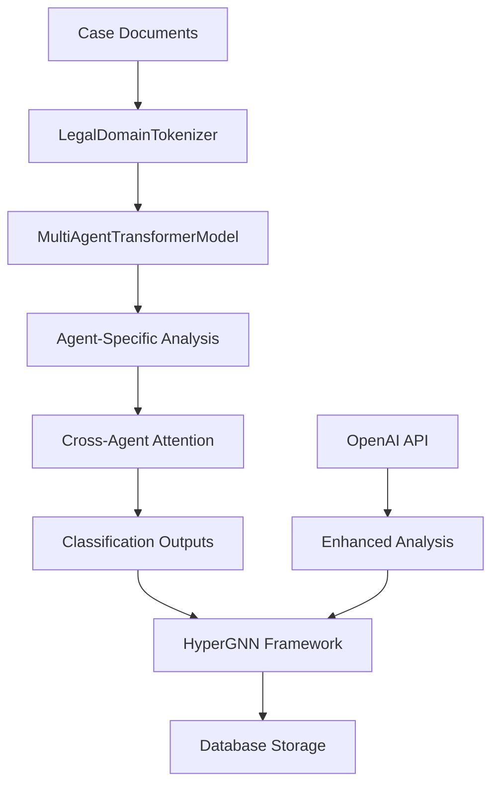

# LLM Transformer Implementation Guide

## Overview

This guide provides a comprehensive approach to implementing the LLM Transformer model within the HyperGNN framework for advanced legal case analysis. The implementation leverages modern transformer architectures with custom modifications for multi-agent perspective analysis.

## Architecture Components

### 1. Enhanced Transformer Model (`enhanced_llm_transformer.py`)

The implementation consists of several key components that work together to provide sophisticated analysis capabilities:

#### Core Components

| Component | Purpose | Key Features |
|-----------|---------|--------------|
| **LegalDomainTokenizer** | Specialized tokenization for legal documents | Custom entity recognition, legal terminology handling, temporal awareness |
| **MultiAgentTransformerModel** | Multi-perspective analysis engine | Agent-specific attention heads, cross-agent attention, multiple classification tasks |
| **OpenAIIntegration** | Enhanced analysis using GPT models | Case summarization, pattern detection, investigation recommendations |
| **LegalTransformerPipeline** | End-to-end processing pipeline | Document analysis, insight aggregation, fine-tuning capabilities |

#### Agent Perspective Mapping

The transformer model maps different agent perspectives to specialized attention heads:

```python
# Agent perspectives supported:
- Victim perspective: Focuses on harm, damages, timeline of events
- Perpetrator perspective: Analyzes actions, motivations, opportunities
- Witness perspective: Emphasizes observations, credibility factors
- Investigator perspective: Concentrates on evidence, patterns, gaps
- Legal counsel perspective: Focuses on legal implications, precedents
```

### 2. Integration with Existing Framework

The LLM transformer integrates seamlessly with the existing HyperGNN components:

#### Data Flow Integration



#### Key Integration Points

1. **Entity Recognition**: Automatically identifies and classifies legal entities from documents
2. **Event Extraction**: Detects and categorizes timeline events with temporal relationships
3. **Relationship Mapping**: Discovers connections between entities and events
4. **Evidence Assessment**: Evaluates evidence strength and reliability

## Implementation Steps

### Step 1: Environment Setup

```bash
# Install required dependencies
pip install -r requirements_llm.txt

# Download required models
python -c "from transformers import BertTokenizer, BertModel; BertTokenizer.from_pretrained('bert-base-uncased'); BertModel.from_pretrained('bert-base-uncased')"

# Set up OpenAI API key (optional but recommended)
export OPENAI_API_KEY="your-api-key-here"
```

### Step 2: Basic Usage

```python
from enhanced_llm_transformer import LegalTransformerPipeline
from case_data_loader import CaseEntity, CaseEvent, InformationStatus

# Initialize the pipeline
pipeline = LegalTransformerPipeline(num_agents=6)

# Prepare case data
entities = [
    CaseEntity("john_doe", "John Doe", "person", ["defendant"], 
               verification_status=InformationStatus.VERIFIED),
    CaseEntity("abc_corp", "ABC Corporation", "organization", ["plaintiff"],
               verification_status=InformationStatus.VERIFIED)
]

events = [
    CaseEvent("contract_signing", datetime(2023, 1, 15), 
              "Contract signed between parties", ["john_doe", "abc_corp"],
              verification_status=InformationStatus.VERIFIED)
]

# Analyze documents
documents = [
    "Contract between John Doe and ABC Corporation signed on January 15, 2023...",
    "Email correspondence regarding contract terms..."
]

results = pipeline.analyze_case_documents(documents, entities, events)
```

### Step 3: Advanced Configuration

#### Custom Agent Perspectives

```python
# Configure specific agent perspectives
agent_config = {
    'victim': {
        'focus_areas': ['damages', 'timeline', 'causation'],
        'temporal_bias': 0.8,  # Focus on recent events
        'evidence_weight': 1.2  # Higher weight on evidence
    },
    'investigator': {
        'focus_areas': ['evidence', 'patterns', 'inconsistencies'],
        'temporal_bias': 0.0,  # No temporal bias
        'evidence_weight': 1.5  # Highest evidence weight
    }
}

# Apply configuration
pipeline.configure_agent_perspectives(agent_config)
```

#### Fine-tuning for Domain Specificity

```python
# Prepare training data
training_data = [
    {
        'text': 'Legal document text...',
        'entities': [{'start': 0, 'end': 10, 'label': 'PERSON'}],
        'events': [{'start': 20, 'end': 35, 'label': 'CONTRACT_SIGNING'}]
    }
    # ... more training examples
]

# Fine-tune the model
pipeline.fine_tune_model(training_data, output_dir="./custom_legal_model")
```

## Advanced Features

### 1. Multi-Modal Analysis

The transformer can be extended to handle multiple types of input:

```python
# Text + metadata analysis
analysis_config = {
    'include_metadata': True,
    'temporal_weighting': True,
    'cross_reference_validation': True
}

results = pipeline.analyze_case_documents(
    documents, entities, events, 
    config=analysis_config
)
```

### 2. Real-time Processing

For large-scale case management:

```python
# Streaming analysis for large document sets
async def process_document_stream(document_stream):
    async for document in document_stream:
        analysis = await pipeline.analyze_document_async(document)
        yield analysis
```

### 3. Explainable AI Features

Understanding model decisions:

```python
# Get attention visualizations
attention_analysis = pipeline.explain_predictions(document, entity_predictions)

# Generate explanation report
explanation = pipeline.generate_explanation_report(
    predictions=results,
    confidence_threshold=0.8
)
```

## Performance Optimization

### 1. Model Optimization

```python
# Enable mixed precision training
pipeline.enable_mixed_precision()

# Use gradient checkpointing for memory efficiency
pipeline.enable_gradient_checkpointing()

# Optimize for inference
pipeline.optimize_for_inference()
```

### 2. Batch Processing

```python
# Process multiple documents efficiently
batch_results = pipeline.analyze_document_batch(
    documents_batch,
    batch_size=16,
    num_workers=4
)
```

### 3. Caching and Persistence

```python
# Cache model outputs
pipeline.enable_caching(cache_dir="./model_cache")

# Save processed results
pipeline.save_analysis_results(results, "case_analysis.json")
```

## Integration with Database

### Automatic Data Synchronization

```python
from database_integration import DatabaseSynchronizer

# Initialize synchronizer
db_sync = DatabaseSynchronizer()

# Automatically sync transformer results
def sync_transformer_results(analysis_results):
    # Extract entities from transformer predictions
    entities = extract_entities_from_predictions(analysis_results)
    
    # Extract events
    events = extract_events_from_predictions(analysis_results)
    
    # Sync to databases
    sync_results = db_sync.sync_case_data(entities, events, [])
    
    return sync_results
```

## Monitoring and Evaluation

### 1. Performance Metrics

```python
# Track model performance
metrics = pipeline.evaluate_performance(test_dataset)
print(f"Entity F1 Score: {metrics['entity_f1']}")
print(f"Event Detection Accuracy: {metrics['event_accuracy']}")
print(f"Cross-Agent Attention Coherence: {metrics['attention_coherence']}")
```

### 2. Continuous Learning

```python
# Implement feedback loop
def update_model_with_feedback(user_corrections):
    # Convert corrections to training format
    training_updates = format_corrections(user_corrections)
    
    # Incremental learning
    pipeline.incremental_update(training_updates)
```

## Deployment Considerations

### 1. Production Deployment

```python
# Production-ready configuration
production_config = {
    'model_path': './production_model',
    'batch_size': 32,
    'max_sequence_length': 512,
    'enable_gpu': True,
    'enable_monitoring': True
}

pipeline = LegalTransformerPipeline(**production_config)
```

### 2. API Endpoint

```python
from fastapi import FastAPI
from pydantic import BaseModel

app = FastAPI()

class AnalysisRequest(BaseModel):
    documents: List[str]
    entities: Optional[List[dict]] = None
    events: Optional[List[dict]] = None

@app.post("/analyze")
async def analyze_documents(request: AnalysisRequest):
    results = pipeline.analyze_case_documents(
        request.documents, 
        request.entities, 
        request.events
    )
    return results
```

### 3. Scaling Considerations

For high-volume processing:

- **Horizontal Scaling**: Deploy multiple instances behind a load balancer
- **Model Sharding**: Distribute different agent perspectives across instances
- **Caching**: Implement Redis for result caching
- **Queue Management**: Use Celery for asynchronous processing

## Security and Privacy

### 1. Data Protection

```python
# Enable data encryption
pipeline.enable_encryption(encryption_key="your-encryption-key")

# Implement data anonymization
anonymized_docs = pipeline.anonymize_documents(documents)
```

### 2. Access Control

```python
# Role-based access to different analysis features
access_control = {
    'investigator': ['full_analysis', 'evidence_assessment'],
    'legal_counsel': ['legal_analysis', 'precedent_search'],
    'analyst': ['pattern_detection', 'timeline_analysis']
}

pipeline.set_access_control(access_control)
```

## Troubleshooting

### Common Issues and Solutions

1. **Memory Issues**: Reduce batch size, enable gradient checkpointing
2. **Slow Performance**: Use GPU acceleration, optimize model for inference
3. **Poor Accuracy**: Fine-tune on domain-specific data, adjust attention weights
4. **Integration Problems**: Check data format compatibility, verify API endpoints

### Debugging Tools

```python
# Enable debug mode
pipeline.enable_debug_mode()

# Visualize attention patterns
pipeline.visualize_attention(document, save_path="attention_viz.png")

# Profile performance
performance_report = pipeline.profile_performance(documents)
```

## Future Enhancements

### Planned Features

1. **Multi-language Support**: Extend to support legal documents in multiple languages
2. **Graph Neural Networks**: Integration with graph-based relationship modeling
3. **Federated Learning**: Enable collaborative model training across organizations
4. **Automated Report Generation**: Generate comprehensive case analysis reports
5. **Real-time Collaboration**: Support for multiple analysts working on the same case

### Research Directions

1. **Causal Inference**: Implement causal relationship detection
2. **Temporal Reasoning**: Enhanced temporal logic and reasoning capabilities
3. **Legal Precedent Matching**: Automatic matching with legal precedents
4. **Bias Detection**: Identify and mitigate bias in legal analysis

This implementation guide provides a comprehensive foundation for deploying and utilizing the LLM transformer within the HyperGNN framework. The modular design allows for gradual implementation and customization based on specific use case requirements.
