# Analysis Repository

## Criminal Case Timeline & Evidence Analysis System

A truthful and accurate analytical framework for building timelines and managing evidence in criminal cases under South African law. Built on a **refined network analysis framework** with evidence-based methods and transparent confidence scoring.

### 🏗️ System Overview

This repository provides a complete suite of tools and frameworks for legal professionals:

- **Refined Network Analysis Framework**: Evidence-based network modeling with transparent confidence scoring
- **Risk Assessment Engine**: Configurable risk analysis based on network connectivity, temporal patterns, and evidence quality
- **Validation System**: Comprehensive data validation ensuring integrity throughout the system
- **Timeline Processing**: Automated tools for timeline construction with temporal consistency validation
- **Evidence Management**: Professional document handling with cryptographic integrity verification
- **Settlement Agreement Analysis**: Comprehensive citizenship status impact analysis for psychological, civil, and commercial matters
- **Analysis Tools**: OCR processing, knowledge matrices, and verification systems
- **Legal Templates**: South African law-compliant documentation and procedures

> 📖 **[Technical Architecture Documentation](TECHNICAL_ARCHITECTURE.md)** - Comprehensive system architecture with Mermaid diagrams
> 
> 🧠 **[OpenCog HGNNQL Case-LLM](docs/OPENCOG_HGNNQL_CASE_LLM.md)** - AI-powered case analysis system
>
> 🔗 **[HyperGraphQL API Documentation](HYPERGRAPHQL_API_DOCUMENTATION.md)** - GraphQL API for hypergraph management
>
> 📁 **[Repository Structure Guide](REPOSITORY_STRUCTURE.md)** - Complete repository organization and structure
>
> 🗂️ **[File Organization Map](FILE_ORGANIZATION_MAP.md)** - Detailed file organization guidelines
>
> 📚 **[Documentation Hub](docs/README.md)** - Centralized documentation with organized categories

### 🤖 Automated Processing

The repository includes an **Auto Entity and Evidence Scan** GitHub Action that automatically:
- Processes new and updated evidence files
- Extracts entities and relationships
- Updates timeline data and models
- Maintains entity databases
- Generates processing reports

**Triggers**: Automatically runs on pushes to main branches or can be manually triggered with custom options.
**Documentation**: [GitHub Action Guide](docs/github-action-auto-entity-scan.md)

### 🚀 Quick Start

#### For Legal Practitioners
1. **Documentation Hub**: Start at [docs/README.md](docs/README.md) for organized access to all documentation
2. **Legal Frameworks**: Review [docs/legal/frameworks/](docs/legal/frameworks/) for case analysis methodologies
3. **Templates**: Access [docs/legal/templates/](docs/legal/templates/) for legal document templates
4. **Evidence Management**: See [Evidence Management Guide](FOLDER_STRUCTURE_IMPLEMENTATION.md) for evidence handling

#### For Technical Users
1. **System Architecture**: Review [Technical Architecture](TECHNICAL_ARCHITECTURE.md) for system design
2. **API Documentation**: Explore [docs/technical/api/](docs/technical/api/) for API integration
3. **Implementation Guides**: Check [docs/technical/guides/](docs/technical/guides/) for development help
4. **Model Documentation**: See [docs/models/](docs/models/) for analytical model details

#### For Analysts
1. **Feature Index**: Browse [docs/FEATURE_INDEX.md](docs/FEATURE_INDEX.md) for capabilities overview
2. **Analysis Tools**: Review [docs/analysis/](docs/analysis/) for analysis workflows
3. **Timeline Processing**: Use [Timeline Processing Guide](timeline-processor.md) for timeline construction
4. **Evidence Analysis**: Check [docs/evidence/](docs/evidence/) for evidence evaluation

#### Quick Demos
```bash
# Run the OpenCog HGNNQL Case-LLM demonstration
python examples/opencog_case_llm_demo.py

# Run the HyperGraphQL demonstration
python demo_hypergraphql.py

# Analyze repository structure
python tools/repository_organizer.py

# Generate documentation
python tools/documentation_generator.py
```

#### OpenCog HGNNQL Case-LLM Demo

```bash
# Run the complete OpenCog Case-LLM demonstration
python examples/opencog_case_llm_demo.py
```

This demonstrates:
- OpenCog-inspired knowledge representation (AtomSpace)
- HGNNQL query language for case analysis
- Hyper-Holmes inference engine for automated reasoning
- Super-Sleuth introspection trainer for pattern learning
- Case-LLM for natural language interaction
- Complete AI-powered case analysis pipeline

#### HyperGraphQL Demo

```bash
# Run the HyperGraphQL demonstration
python demo_hypergraphql.py
```

This demonstrates:
- Schema creation and management
- GitHub repository projection
- Organization-aware operations
- Scaling capabilities (compression, aggregation, enterprise)

### 🤖 Automated Model Simulations

The repository includes comprehensive GitHub Actions workflows for running simulations across all model types:

#### Available Simulation Types
- **Agent-Based Models (HyperGNN)**: Multi-agent behavioral dynamics and network analysis
- **Discrete Event Models**: Event cascade simulation and timing optimization
- **System Dynamics Models**: Flow optimization and equilibrium analysis  
- **Integrated Multi-Models**: Combined HyperGNN + Case-LLM transformer analysis

#### Running Simulations

**Via GitHub Actions (Recommended):**
1. Go to the "Actions" tab in GitHub
2. Select "Run Model Simulations" workflow
3. Choose simulation type (all, agent-based, discrete-event, system-dynamics, or integrated-multi-model)
4. Specify case ID and run

**Locally via Scripts:**
```bash
# Agent-based simulation
python scripts/run_agent_based_simulation.py --case-id "case_2025_001" --output-dir sims

# Discrete event simulation  
python scripts/run_discrete_event_simulation.py --case-id "case_2025_001" --output-dir sims

# System dynamics simulation
python scripts/run_system_dynamics_simulation.py --case-id "case_2025_001" --output-dir sims

# Integrated multi-model simulation
python scripts/run_integrated_simulation.py --case-id "case_2025_001" --output-dir sims

# Generate comprehensive report
python scripts/generate_simulation_report.py --results-dir sims --case-id "case_2025_001" --output-dir sims
```

#### Simulation Outputs
All simulations save timestamped results to the `sims/` directory with:
- **JSON Results**: Complete simulation data and metrics
- **Entity-Relation Inventories**: Updated inventories with relationships and metadata
- **Simulation Summaries**: Executive summaries with key findings
- **Comprehensive Reports**: Cross-model analysis and recommendations (when running all models)

#### Case-LLM Transformer Documentation
- **[Case-LLM Transformer Insights](docs/case-llm-transformer-insights.md)**: Comprehensive model insights and multi-perspective analysis
- **[Transformer Model Weights Analysis](docs/transformer-model-weights-analysis.md)**: Detailed weight analysis and attention head narratives

### 🎯 System Architecture


## 📚 Documentation Navigation

### Organized Documentation Structure

The repository now features a comprehensive, organized documentation structure. All documentation is categorized and easily discoverable:

#### 📁 [Documentation Hub](docs/README.md)
Central hub for all documentation with organized categories:

- **[Models Documentation](docs/models/)** - All analytical model documentation
  - [HyperGNN Framework](docs/models/hypergnn/) - Multi-layer network modeling
  - [LLM Transformers](docs/models/llm/) - Language model transformers
  - [Discrete Event Models](docs/models/discrete_event/) - Event-driven modeling
  - [System Dynamics](docs/models/system_dynamics/) - Flow and dynamics modeling

- **[Analysis Documentation](docs/analysis/)** - Analysis reports and findings
  - [Findings](docs/analysis/findings/) - Investigation discoveries
  - [Reports](docs/analysis/reports/) - Comprehensive analysis reports
  - [Summaries](docs/analysis/summaries/) - Executive summaries

- **[Evidence Documentation](docs/evidence/)** - Evidence management docs
  - [Reports](docs/evidence/reports/) - Evidence analysis reports
  - [Verification](docs/evidence/verification/) - Verification documentation

- **[Technical Documentation](docs/technical/)** - Technical references
  - [Architecture](docs/technical/architecture/) - System architecture
  - [API Documentation](docs/technical/api/) - API references
  - [Implementation Guides](docs/technical/guides/) - How-to guides

- **[Legal Documentation](docs/legal/)** - Legal frameworks and templates
  - [Frameworks](docs/legal/frameworks/) - Legal analysis frameworks
  - [Templates](docs/legal/templates/) - Legal document templates
  - [Procedures](docs/legal/procedures/) - Legal procedures

#### 📊 Quick Reference Documents

- **[Repository Structure Guide](REPOSITORY_STRUCTURE.md)** - Complete structure overview
- **[File Organization Map](FILE_ORGANIZATION_MAP.md)** - File organization guidelines
- **[Feature Index](docs/FEATURE_INDEX.md)** - Complete feature catalog

---

## Document Index

### 📋 Core Framework
| Document | Purpose | Use Case |
|----------|---------|----------|
| **[📖 Technical Architecture](TECHNICAL_ARCHITECTURE.md)** | **Complete system architecture with Mermaid diagrams** | **System understanding & development** |
| [Criminal Case Timeline Outline](criminal-case-timeline-outline-sa.md) | Comprehensive procedural framework | General case timeline construction |
| [Timeline Processing Guide](timeline-processor.md) | Tools for processing and validating timelines | Timeline analysis and workflow enhancement |
| [HyperGNN Framework Schema](HYPERGNN_COMPREHENSIVE_SCHEMA.md) | Detailed framework documentation | Advanced analytical capabilities |
| [Evidence Thread Analysis](docs/eviden-thread.md) | Detailed case study and procedures | Complex cases with safety concerns |
| [Court Order Template](docs/court_order_2025_137857.md) | High Court order example (Case 2025-137857) | Reference for court order structure and format |
| [Court Order Cross-Reference Analysis](docs/court-order-timeline-cross-reference-analysis.md) | Cross-reference analysis of court order vs timeline | Case analysis and gap identification |
| [Current State Summary](docs/current-state-summary-2025.md) | Executive summary of current affairs | Quick overview and action requirements |
| [Formal Notice Template](docs/FORMAL%20NOTICE%20OF%20VOIDNESS%20DUE%20TO%20PERJURY%20AND%20FRAUD.md) | Legal notice template | Void proceedings due to fraud |
| [OCR Email CC Analysis](docs/ocr-email-cc-analysis-critical-findings.md) | 🚨 CRITICAL: Email CC deception analysis | Proves information warfare and intermediary control |

### 🔧 Technical Components

#### Core Framework Files
- **[hypergnn_framework.py](hypergnn_framework.py)** - Main framework integration and API
- **[frameworks/hypergnn_core.py](frameworks/hypergnn_core.py)** - HyperGNN framework engine
- **[frameworks/evidence_management.py](frameworks/evidence_management.py)** - Evidence handling system
- **[frameworks/system_dynamics.py](frameworks/system_dynamics.py)** - System dynamics modeling
- **[frameworks/professional_language.py](frameworks/professional_language.py)** - Language processing

#### Analysis Tools
- **[tools/timeline_validator.py](tools/timeline_validator.py)** - Timeline validation utilities
- **[tools/knowledge_matrix.py](tools/knowledge_matrix.py)** - Knowledge relationship tracking
- **[tools/ocr_analyzer.py](tools/ocr_analyzer.py)** - OCR processing and analysis
- **[tools/verification_tracker.py](tools/verification_tracker.py)** - Evidence verification system

### 🚨 Current Case Analysis
- **[Current State Summary 2025](docs/current-state-summary-2025.md)** - Executive dashboard showing critical gaps and immediate action requirements
- **[Court Order Cross-Reference Analysis](docs/court-order-timeline-cross-reference-analysis.md)** - Detailed mapping of court order claims vs timeline evidence
- **[OCR Email CC Analysis](docs/ocr-email-cc-analysis-critical-findings.md)** - 🚨 **EXPLOSIVE**: Proves email CC deception and information warfare patterns
- **[CCE20250929 Document Analysis](docs/jacqui-faucitt-draft-response/)** - Comprehensive OCR analysis of case documents with evidence organization

### 🎯 Quick Access by Topic
- **🏗️ System Architecture** → **[Technical Architecture Documentation](TECHNICAL_ARCHITECTURE.md)**
- **Timeline Construction** → [Criminal Case Timeline Outline](criminal-case-timeline-outline-sa.md)
- **Timeline Processing & Validation** → [Timeline Processing Guide](timeline-processor.md)
- **Framework Details** → [HyperGNN Comprehensive Schema](HYPERGNN_COMPREHENSIVE_SCHEMA.md)
- **Settlement Agreement Analysis** → [Settlement Agreement Analysis Framework](models/frameworks/settlement_agreement_analysis.md)
- **Citizenship Settlement Analysis** → [Citizenship Status in Settlement Agreements](models/frameworks/citizenship_settlement_analysis.md)
- **Current Case Analysis** → [Current State Summary 2025](docs/current-state-summary-2025.md)
- **Court Order Analysis** → [Cross-Reference Analysis](docs/court-order-timeline-cross-reference-analysis.md)
- **🚨 Email CC Deception Evidence** → [OCR Analysis](docs/ocr-email-cc-analysis-critical-findings.md)
- **📁 CCE20250929 Document Schema** → [Jacqui Faucitt Draft Response](docs/jacqui-faucitt-draft-response/)
- **Safety and Emergency Procedures** → [Evidence Thread Analysis](docs/eviden-thread.md#immediate-safety-priorities)
- **Court Order Examples** → [Court Order Template](docs/court_order_2025_137857.md)
- **Legal Templates** → [Formal Notice Template](docs/FORMAL%20NOTICE%20OF%20VOIDNESS%20DUE%20TO%20PERJURY%20AND%20FRAUD.md)
- **Hawks Procedures** → [Evidence Thread Analysis](docs/eviden-thread.md#how-to-file-with-hawks---step-by-step)
- **Document Preparation** → [Evidence Thread Analysis](docs/eviden-thread.md#document-preparation-checklist)

### 📊 Analysis Workflow


### 🏛️ Citizenship Settlement Analysis Framework

This repository now includes comprehensive tools for analyzing how citizenship status impacts settlement agreements, particularly addressing the distinction between psychological/civil matters versus commercial matters.

#### Key Features
- **Citizenship Impact Assessment**: Analyze how different citizenship statuses (full citizen, permanent resident, temporary resident, etc.) affect settlement enforceability
- **Settlement Type Classification**: Distinguish between psychological, civil, commercial, and property settlements with different citizenship impact levels
- **Cross-Jurisdictional Analysis**: Handle complex scenarios involving multiple jurisdictions and dual citizenship
- **Cultural Competency Evaluation**: Assess cultural and language requirements for psychological settlements
- **British Tax-Vote Disconnect Principle**: Understand how civic rights and fiscal obligations can be separated in settlement agreements

#### Usage Examples

```python
from tools.citizenship_settlement_analyzer import CitizenshipSettlementAnalyzer, CitizenshipProfile, SettlementType

# Analyze British permanent resident taxation vs voting rights
analyzer = CitizenshipSettlementAnalyzer()
british_profile = CitizenshipProfile(
    primary_citizenship="British",
    residency_status=CitizenshipStatus.PERMANENT_RESIDENT,
    tax_residence="UK"
)

# Civil settlements can enforce tax obligations but not voting rights
assessment = analyzer.analyze_citizenship_impact(british_profile, SettlementType.CIVIL_PERSONAL)
print(f"Enforceable: {assessment.enforceable_elements}")  # Includes tax obligations
print(f"Unenforceable: {assessment.unenforceable_elements}")  # Includes voting agreements
```

#### Case 2025_137857 Integration

The framework specifically addresses the psychological settlement aspects in Case 2025_137857, showing how medical testing provisions create different enforceability patterns based on citizenship status and constitutional protections.

### Available Resources

#### General Guidelines
- **[Criminal Case Timeline Outline](criminal-case-timeline-outline-sa.md)** - A comprehensive outline for building timelines in criminal cases under South African law, covering all phases from initial incident to final resolution.
- **[Timeline Processing Guide](timeline-processor.md)** - Tools and workflows for processing, validating, and extracting information from timeline documents.

#### Processing Tools
- **[Timeline Validator](tools/timeline_validator.py)** - Python utility for automated timeline validation against framework requirements
- **[Citizenship Settlement Analyzer](tools/citizenship_settlement_analyzer.py)** - Comprehensive analyzer for citizenship status impacts on settlement agreements
- **[Integrated Settlement Analysis](tools/integrated_settlement_citizenship_analysis.py)** - Combined settlement and citizenship analysis for Case 2025_137857

#### Case-Specific Documentation
- **[Evidence Thread Analysis](docs/eviden-thread.md)** - Detailed analysis and guidance for a specific criminal case involving perjury, fraud, and procedural matters
- **[Court Order Example](docs/court_order_2025_137857.md)** - High Court order template demonstrating proper legal formatting and structure (Case 2025-137857)
- **[APR-SEP-2025 Timeline](docs/APR-SEP-2025.md)** - Comprehensive timeline example demonstrating framework application
- **[Formal Notice of Voidness](docs/FORMAL%20NOTICE%20OF%20VOIDNESS%20DUE%20TO%20PERJURY%20AND%20FRAUD.md)** - Template for formal legal notice regarding void proceedings due to perjury and fraud

### Purpose

This repository serves as a reference guide for legal practitioners, law students, and legal professionals working with criminal cases in South Africa. The documentation provides structured approaches to timeline construction, ensuring procedural compliance and effective case management.

### Usage Workflow

The timeline framework can be used as:
- A checklist for case preparation
- A reference for procedural deadlines
- A guide for documentation requirements
- A framework for case management systems
- A validation tool for timeline accuracy
- A processing system for extracting key information

### Best Practices for Legal Practitioners

#### Documentation Management
- **Maintain version control** of all timeline documents
- **Use consistent naming conventions** for case files
- **Create backup systems** for critical documentation
- **Implement regular review cycles** for timeline accuracy

#### Template Customization
- **Always review templates** with qualified legal counsel before use
- **Maintain original templates** as reference copies
- **Document all customizations** made for specific cases
- **Create case-specific checklists** from general templates

#### Quality Assurance
- **Cross-reference multiple sources** for date verification
- **Maintain detailed audit trails** for all timeline entries
- **Regular team reviews** of timeline accuracy
- **Client communication protocols** for timeline updates

#### Technology Integration
- **Digital case management systems** for timeline tracking
- **Automated deadline alerts** for critical dates
- **Secure cloud storage** for document access
- **Regular backup protocols** for data protection

### Document Relationships

The documentation follows a structured hierarchy with clear interdependencies for optimal workflow:

```mermaid
graph TB
    subgraph "Core Documentation"
        README[📄 README.md]
        TECH[📖 Technical Architecture]
        SCHEMA[📋 HyperGNN Schema]
    end
    
    subgraph "Framework Guides"
        TIMELINE[📋 Timeline Outline]
        PROCESSOR[⚙️ Timeline Processor]
        EVIDENCE[🔍 Evidence Thread]
    end
    
    subgraph "Case Documentation"
        STATE[📊 Current State]
        COURT[⚖️ Court Order Analysis]
        OCR[🚨 OCR Analysis]
    end
    
    subgraph "Templates & Tools"
        FORMAL[📝 Formal Notice]
        ORDER[📄 Court Order Template]
        TOOLS[🔧 Processing Tools]
    end
    
    README --> TECH
    README --> SCHEMA
    TECH --> TIMELINE
    TECH --> PROCESSOR
    TIMELINE --> EVIDENCE
    PROCESSOR --> STATE
    EVIDENCE --> COURT
    STATE --> OCR
    COURT --> FORMAL
    OCR --> ORDER
    FORMAL --> TOOLS
```



### 📁 Repository Structure

```
analysis/
├── 📖 TECHNICAL_ARCHITECTURE.md     # Comprehensive system architecture
├── 📋 HYPERGNN_COMPREHENSIVE_SCHEMA.md # Framework detailed documentation
├── 📄 README.md                     # This navigation guide
├── 📋 criminal-case-timeline-outline-sa.md # SA law framework
├── ⚙️ timeline-processor.md          # Processing workflow guide
├── 
├── frameworks/                      # Core analytical frameworks
│   ├── 🧠 hypergnn_core.py          # HyperGNN framework engine
│   ├── 📁 evidence_management.py    # Professional evidence handling
│   ├── 🌊 system_dynamics.py        # System dynamics modeling
│   └── 📝 professional_language.py  # Language processing
├── 
├── tools/                          # Analysis and processing tools
│   ├── ✅ timeline_validator.py      # Timeline validation utilities
│   ├── 🧩 knowledge_matrix.py       # Knowledge relationship tracking
│   ├── 👁️ ocr_analyzer.py           # OCR processing and analysis
│   └── 🔍 verification_tracker.py   # Evidence verification system
├── 
├── docs/                           # Case-specific documentation
│   ├── 🔍 eviden-thread.md          # Evidence analysis procedures
│   ├── ⚖️ court-order-*.md          # Court order templates & analysis
│   ├── 📊 current-state-summary-2025.md # Executive dashboard
│   ├── 🚨 ocr-email-cc-analysis-*.md # Critical OCR findings
│   ├── 📝 FORMAL NOTICE*.md          # Legal templates
│   └── 📁 jacqui-faucitt-draft-response/ # CCE20250929 document schema
│       ├── 📷 CCE20250929*.jpg      # Original case documents
│       ├── 📄 ocr-analysis-*.md     # Individual OCR reports
│       └── 📋 README.md             # Schema index and overview
└── 
└── 🧠 hypergnn_framework.py         # Main framework integration API
```

## 🚀 Getting Started

### Prerequisites

- Python 3.8+
- Required Python packages (automatically handled by framework)
- Access to case documentation and evidence files

### Basic Usage

#### 1. Framework Initialization
```python
from hypergnn_framework import HyperGNNFramework, AnalysisConfiguration

# Initialize framework for comprehensive analysis
config = AnalysisConfiguration(
    case_id="your_case_id",
    scope=AnalysisScope.COMPREHENSIVE,
    complexity_level=ComplexityLevel.ADVANCED
)

framework = HyperGNNFramework(config)
```

#### 2. Load and Process Timeline
```python
# Load timeline data
framework.load_timeline_data("path/to/timeline.md")

# Process and validate
results = framework.process_timeline()
```

#### 3. Generate Analysis Reports
```python
# Generate comprehensive analysis
analysis = framework.generate_analysis()

# Export results
framework.export_reports(output_dir="./analysis_output")
```

### 📊 Performance Characteristics

| Component | Processing Speed | Memory Usage | Storage |
|-----------|-----------------|--------------|---------|
| HyperGNN Framework | 10K+ events/min | 512MB-2GB | Minimal |
| Timeline Processor | 1K+ docs/hour | 256MB-1GB | Document store |
| Evidence Management | 50K+ items | 1GB-4GB | Full archive |

## 🔧 Development

### Testing

Run the test suite to validate the codebase:

```bash
# Run all tests
pytest tests/

# Run with coverage
pytest tests/ --cov=src --cov-report=html

# Run only unit tests
pytest tests/unit/ -v

# Run validation script (linting + formatting + tests)
python3 scripts/validate_codebase.py
```

See [TESTING.md](TESTING.md) for comprehensive testing documentation.

### Framework Extension

The system is designed for extensibility and customization:

```python
# Custom analysis components
class CustomAnalyzer(AnalysisComponent):
    def analyze(self, data):
        # Your custom analysis logic
        return analysis_results

# Register with framework
framework.register_component('custom_analyzer', CustomAnalyzer())
```

### Integration Points

- **REST API**: HTTP endpoints for external system integration
- **Python API**: Direct framework access for custom applications  
- **CLI Tools**: Command-line utilities for automation
- **Export Formats**: JSON, CSV, PDF, and Markdown output

### Contributing

1. Fork the repository
2. Create a feature branch
3. Implement changes with proper documentation
4. Add tests for new functionality
5. Submit pull request with detailed description

## 📋 Workflow Integration

For new users, we recommend this workflow:

1. **📖 Technical Overview**: Start with [Technical Architecture](TECHNICAL_ARCHITECTURE.md) for comprehensive system understanding
2. **⚖️ Legal Framework**: Review [Criminal Case Timeline Outline](criminal-case-timeline-outline-sa.md) for SA law procedures  
3. **⚙️ Processing Tools**: Study [Timeline Processing Guide](timeline-processor.md) for workflow automation
4. **🔍 Practical Application**: Read [Evidence Thread Analysis](docs/eviden-thread.md) for real-world examples
5. **📊 Case Study**: Examine [Current State Summary](docs/current-state-summary-2025.md) for comprehensive case analysis

### 🎯 Recommended Learning Path

```mermaid
graph TD
    START[New User] --> README[📄 README Overview]
    README --> TECH[📖 Technical Architecture]
    TECH --> FRAMEWORK[📋 Legal Framework]
    FRAMEWORK --> TOOLS[⚙️ Processing Tools] 
    TOOLS --> PRACTICE[🔍 Practical Examples]
    PRACTICE --> ADVANCED[🚀 Advanced Features]
    
    ADVANCED --> EXPERT[👨‍💼 Expert Usage]
    
    style START fill:#e1f5fe
    style EXPERT fill:#c8e6c9
## 📚 Template Customization Guide

The documentation includes template sections with placeholders that should be customized for specific cases:

### Common Placeholders
- **`[Name]`** - Replace with actual person names
- **`[Today's Date]`** - Replace with current date in format: DD Month YYYY
- **`[Date]`** - Replace with specific relevant dates
- **`[Your Name]`, `[Your Full Name]`** - Replace with user's legal name
- **`[Case Reference]`** - Replace with actual case numbers

### Customization Best Practices
1. **Review all placeholder content** before using any template
2. **Verify legal accuracy** with qualified legal counsel
3. **Update dates and references** to match specific case details
4. **Maintain document integrity** when making modifications
5. **Keep backup copies** of original templates

## 🔍 Search and Reference Guide

### Finding Specific Information
| Topic | Primary Location | Additional References |
|-------|------------------|----------------------|
| **System Architecture** | [Technical Architecture](TECHNICAL_ARCHITECTURE.md) | [HyperGNN Schema](HYPERGNN_COMPREHENSIVE_SCHEMA.md) |
| **Timeline Construction** | [Criminal Case Timeline](criminal-case-timeline-outline-sa.md) | [Evidence Thread Examples](docs/eviden-thread.md) |
| **Timeline Processing** | [Timeline Processing Guide](timeline-processor.md) | [APR-SEP-2025 Example](docs/APR-SEP-2025.md) |
| **Safety Procedures** | [Evidence Thread - Safety](docs/eviden-thread.md#immediate-safety-priorities) | [Document Preparation](docs/eviden-thread.md#document-preparation-checklist) |
| **Court Procedures** | [Timeline Outline - Trial Phase](criminal-case-timeline-outline-sa.md#trial-phase) | [Evidence Thread - Legal Process](docs/eviden-thread.md) |
| **Evidence Handling** | [Timeline Outline - Documentation](criminal-case-timeline-outline-sa.md#documentation-requirements) | [Evidence Thread - Preservation](docs/eviden-thread.md#evidence-preservation) |

## ⚖️ Legal Disclaimer

This documentation is for informational purposes only and does not constitute legal advice. Legal practitioners should always consult current legislation and seek appropriate professional guidance for specific cases.

---

## 🏆 About

**Analysis Repository** - A comprehensive criminal case timeline and evidence analysis system for South African law, powered by the advanced HyperGNN Framework for multi-dimensional case analysis.

For technical details and system architecture, see: **[📖 Technical Architecture Documentation](TECHNICAL_ARCHITECTURE.md)**


### 🇿🇦 South African AI Legislation Compliance

This repository now includes a comprehensive framework for ensuring compliance with South African AI and information handling legislation. This is critical for any operations within South Africa and serves as a foundational component of the legal and risk analysis capabilities of this system.

- **[SA AI Legislation Compliance Guide](evidence/sa_ai_legislation_compliance/SA_AI_Legislation_Compliance_Guide.md)**: A detailed guide to the legal landscape of AI in South Africa.
- **[Entities and Timeline](evidence/sa_ai_legislation_compliance/entities_and_timeline.json)**: Key entities and a timeline of legislative and communicative events.
- **[Compliance Deadline Tracker](tools/compliance_deadline_tracker.py)**: A tool to track and report on upcoming legal deadlines.
- **[AI Fraud Detector](tools/ai_fraud_detector.py)**: A tool to detect AI-enabled fraud patterns.

