# Technical Architecture Documentation

## Overview

The Analysis Repository is a comprehensive criminal case timeline and evidence analysis system built around the HyperGNN Framework. It provides sophisticated tools for legal professionals working with complex criminal cases under South African law, featuring automated timeline processing, evidence management, and advanced analytical capabilities.

## System Architecture

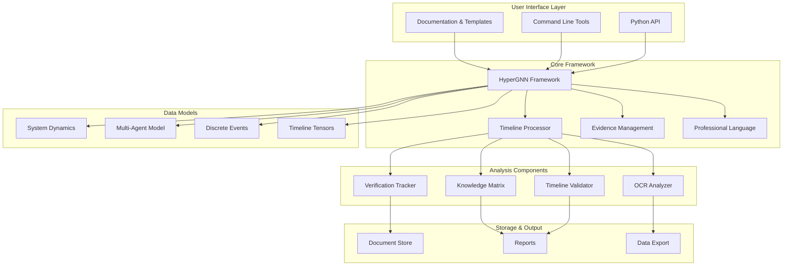

## HyperGraphQL API Architecture

The HyperGraphQL API provides a GraphQL-based interface for org-aware repository management and hypergraph operations.

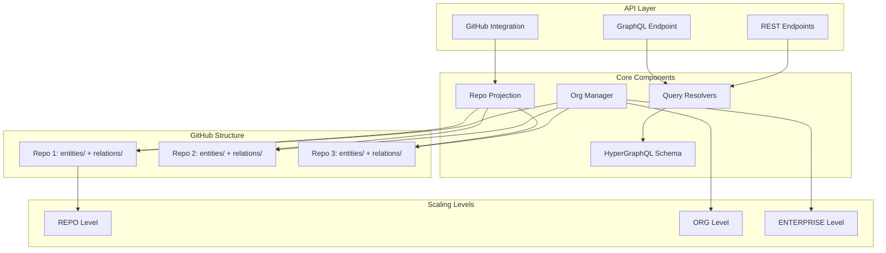

## HyperGNN Framework Architecture

The HyperGNN Framework is the core analytical engine providing multilayer network modeling and timeline tensor analysis.

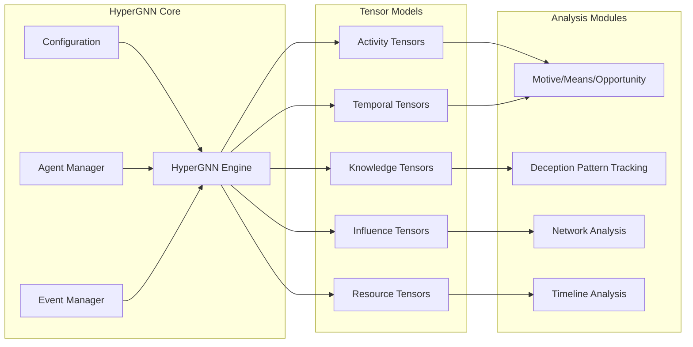

## Component Interaction Flow

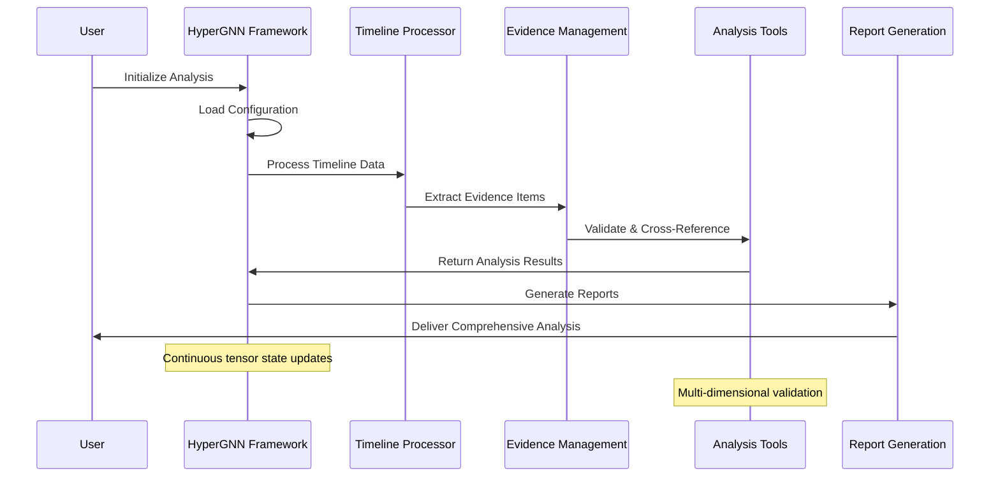

## Data Flow Architecture

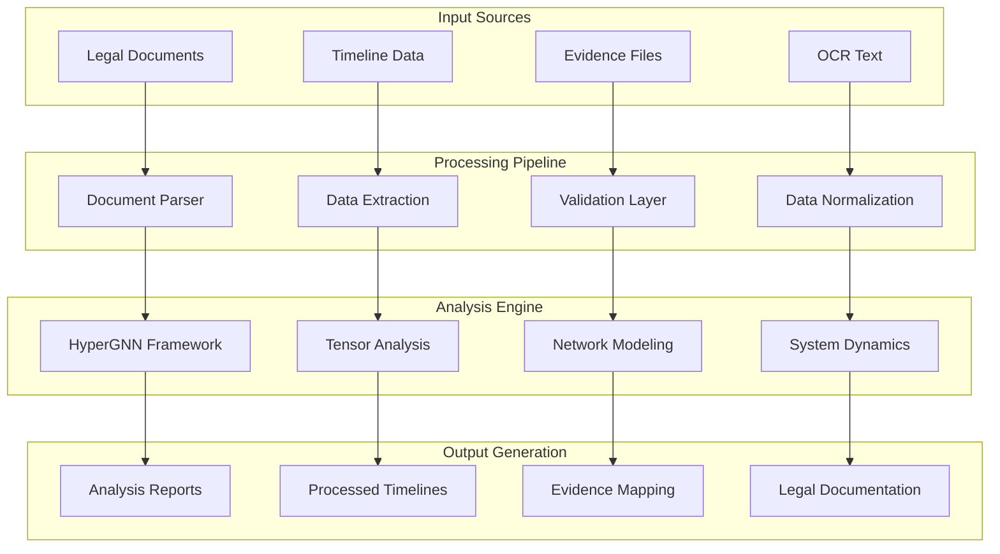

## Timeline Processing Workflow

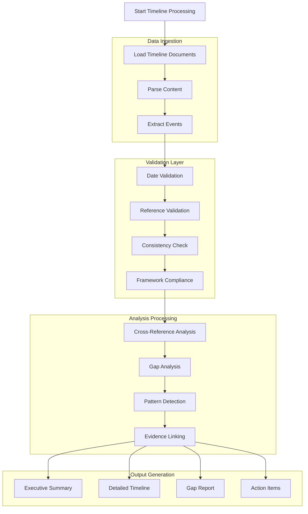

## Evidence Management System

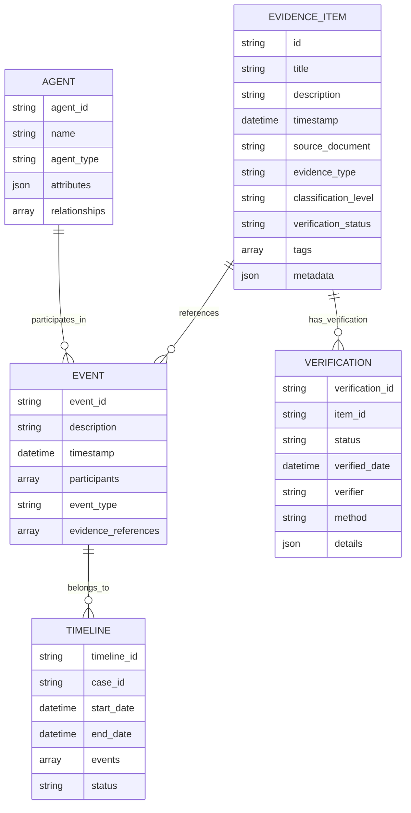

## Tool Integration Architecture

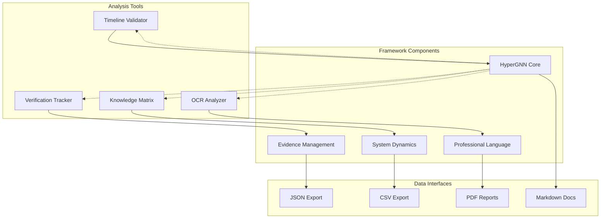

## Security and Compliance

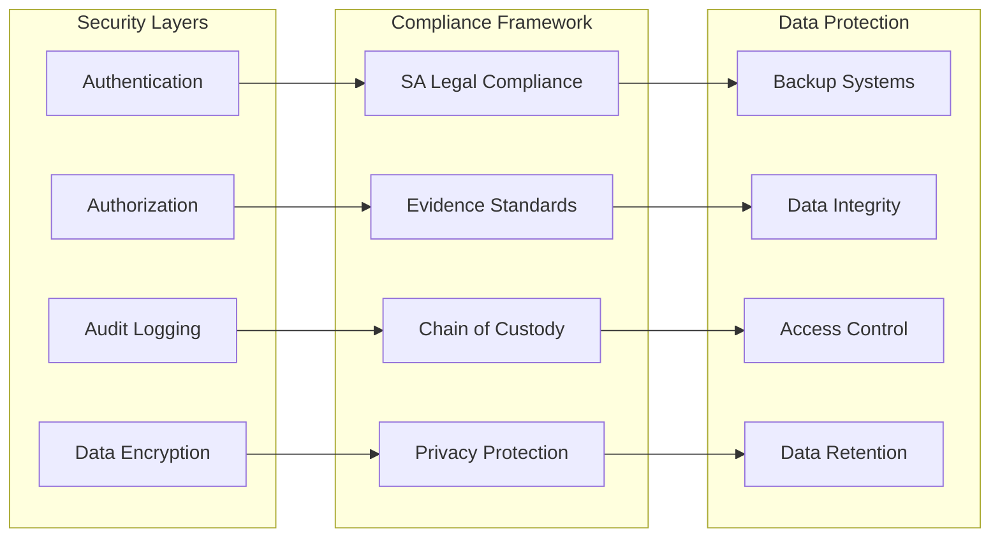

## Performance and Scalability

### Component Performance Characteristics

| Component | Processing Capacity | Memory Usage | Storage Requirements |
|-----------|-------------------|--------------|---------------------|
| HyperGNN Framework | 10K+ events/minute | 512MB - 2GB | Minimal (in-memory) |
| Timeline Processor | 1K+ documents/hour | 256MB - 1GB | Document storage |
| Evidence Management | 50K+ items | 1GB - 4GB | Full document archive |
| OCR Analyzer | 100+ pages/minute | 128MB - 512MB | Image cache |
| Knowledge Matrix | Real-time updates | 64MB - 256MB | Relationship data |

### Scalability Patterns

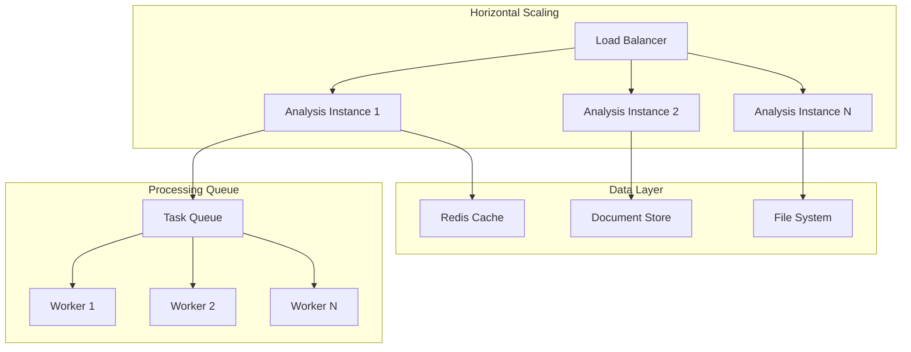

## Development and Deployment

### Project Structure

```
analysis/
├── frameworks/                 # Core analytical frameworks
│   ├── hypergnn_core.py       # HyperGNN framework engine
│   ├── evidence_management.py # Evidence handling system
│   ├── system_dynamics.py     # System dynamics modeling
│   └── professional_language.py # Language processing
├── tools/                     # Analysis and processing tools
│   ├── timeline_validator.py  # Timeline validation utilities
│   ├── knowledge_matrix.py    # Knowledge relationship tracking
│   ├── ocr_analyzer.py       # OCR processing and analysis
│   └── verification_tracker.py # Evidence verification
├── docs/                      # Case-specific documentation
│   ├── eviden-thread.md      # Evidence analysis procedures
│   ├── court-order-*.md      # Court order templates
│   └── *.md                  # Various case documents
├── hypergnn_framework.py      # Main framework integration
├── timeline-processor.md      # Timeline processing guide
├── criminal-case-timeline-outline-sa.md # SA law framework
└── README.md                  # Project documentation
```

### Integration Points

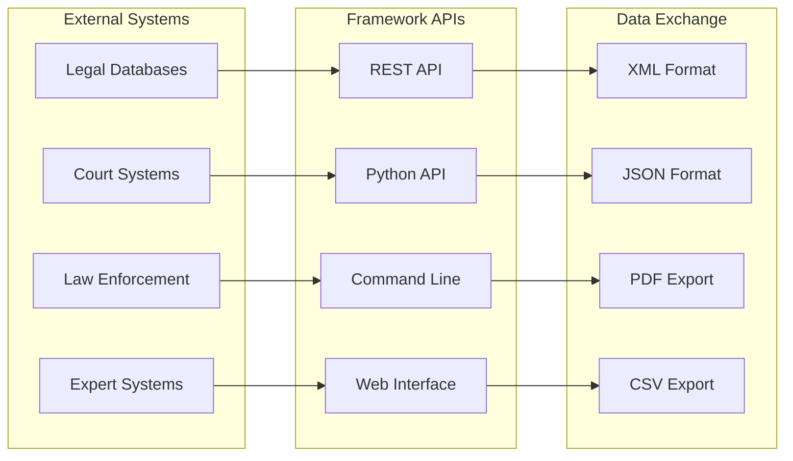

## Quality Assurance

### Testing Strategy

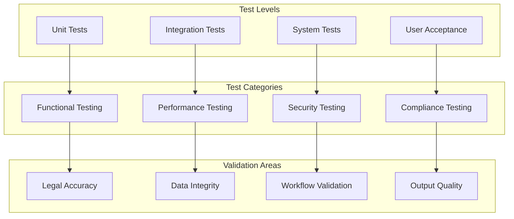

### Continuous Integration

- **Code Quality**: Automated linting and style checking
- **Test Coverage**: Comprehensive test suite execution
- **Security Scanning**: Vulnerability assessment
- **Documentation**: Automated documentation generation
- **Compliance Validation**: Legal framework alignment checks

## Future Enhancements

### Planned Features

1. **Machine Learning Integration**
   - Pattern recognition for deception detection
   - Automated timeline gap identification
   - Predictive analysis for case outcomes

2. **Advanced Visualization**
   - Interactive timeline exploration
   - Network relationship mapping
   - Real-time analysis dashboards

3. **Enhanced Integration**
   - Direct court system integration
   - Law enforcement database connections
   - Expert system consultations

4. **Mobile Access**
   - Mobile-responsive interfaces
   - Offline analysis capabilities
   - Secure mobile data access

### Technology Roadmap

```mermaid
timeline
    title Technology Evolution Roadmap
    
    section Current State
        HyperGNN Framework    : Core analytical engine
        Timeline Processing   : Automated workflow tools
        Evidence Management   : Professional document handling
    
    section Phase 1 (Q1-Q2)
        ML Integration       : Pattern recognition
        Enhanced UI          : Interactive dashboards
        Mobile Support       : Responsive design
    
    section Phase 2 (Q3-Q4)
        AI Assistance        : Automated analysis
        Court Integration    : Direct system links
        Advanced Security    : Enhanced protection
    
    section Future Vision
        Full Automation      : End-to-end processing
        Predictive Analytics : Outcome forecasting
        Global Expansion     : Multi-jurisdiction support
```

## Conclusion

The Analysis Repository represents a comprehensive, professional-grade system for criminal case analysis under South African law. Through the integration of advanced analytical frameworks, automated processing tools, and professional documentation standards, it provides legal professionals with powerful capabilities for handling complex criminal cases.

The HyperGNN Framework at its core enables sophisticated multi-dimensional analysis, while the surrounding tools and documentation ensure practical applicability and professional compliance. The system's modular architecture supports both current operational requirements and future enhancement opportunities.

For technical implementation details, refer to the individual framework documentation files and the comprehensive API documentation in the respective Python modules.