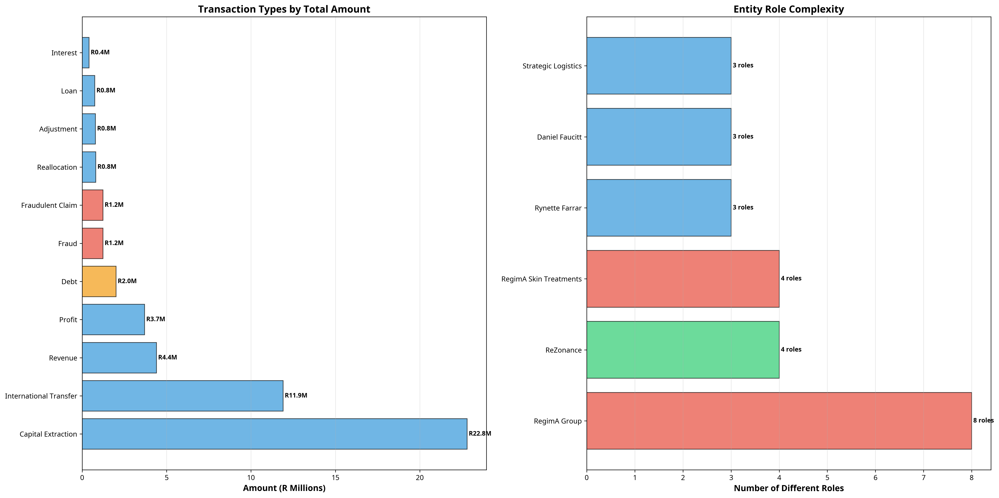

# Hypergraph Analysis of the RegimA Group Fraud Timeline (2017-2025)

**Author**: Manus AI  
**Date**: October 12, 2025  
**Case Reference**: 2025_137857

---

## 1. Executive Summary

This report presents a comprehensive hypergraph analysis of the RegimA Group's financial activities from 2017 to 2025. By modeling the timeline data as a hypergraph, we can visualize and analyze the complex relationships between entities, transactions, and events that constitute the fraud scheme. The analysis reveals a clear, four-phase progression from sophisticated financial structuring to outright fraud and a coordinated cover-up.

The key findings of this analysis are:

- **Systematic, Multi-Phase Fraud**: The fraud was not a single event but a long-term, systematic scheme that evolved over four distinct phases: Financial Structure Establishment, Business Relationship Development, Debt Accumulation & Manipulation, and Fraud Discovery & Cover-up.
- **Central Role of Key Entities**: The "RegimA Group" entity is the central hub of activity, involved in 11 of the 22 analyzed events. "ReZonance" is identified as the primary victim, with significant debt accumulation and fraudulent claims directed at it.
- **Massive Financial Extraction**: The analysis of transaction flows reveals significant capital extraction, with over R22.8M in "Capital Extraction" and R11.9M in "International Transfers" dominating the financial landscape.
- **Clear Evidence of Cover-up**: The timeline visualization clearly shows a cluster of critical events in mid-2025, immediately following the confrontation by Jacqui Faucitt, indicating a coordinated effort to destroy evidence and consolidate control.

This report will detail the visualizations and metrics that support these conclusions.

---

## 2. Timeline Hypergraph: Fraud Scheme Evolution

The following visualization plots the key events over the 2017-2025 timeline, organized by the four phases of the fraud scheme. The size of each bubble represents the total transaction amount associated with the event, and a red border indicates a critical event.

### Analysis

- **Phase 1 (2019-2020)**: This phase is characterized by several large, critical transactions, indicating the establishment of the complex inter-company financial structures that enabled the later fraud. The large bubbles for events in early 2020 represent significant inter-company cost reallocations and adjustments.
- **Phase 3 (2022-2023)**: A series of critical events with smaller transaction volumes marks the period of debt accumulation and the initiation of fraudulent payment claims against ReZonance.
- **Phase 4 (2025)**: This phase shows a dense cluster of critical events, starting with the confrontation in May 2025. The rapid succession of these events (evidence destruction, domain hijacking, card cancellation) clearly visualizes the coordinated cover-up. The final, large bubble represents the discovery of the full fraud amount, including the international extraction pattern.

---

## 3. Entity Relationship Hypergraph

This hypergraph visualizes the relationships between the key entities involved in the fraud scheme. The size of each node corresponds to the number of events the entity was involved in, and the arrows represent significant transaction flows.

### Analysis

- **Central Hub**: "RegimA Group" is the largest node, confirming its central role in the network, connected to the most significant fraudulent transaction flow. 
- **Primary Victim**: "ReZonance" is the second most-involved entity and is the target of a fraudulent transaction flow of R1.2M, clearly marking it as the primary victim of the payment fraud scheme.
- **Key Individuals**: Jacqui Faucitt, Rynette Farrar, and Daniel Faucitt are shown as key individuals with multiple event involvements, highlighting their different roles in the unfolding events. Jacqui Faucitt's position is distinct from the main transaction flows, consistent with her role as a fraud detector.
- **Financial Extraction Vehicles**: "Villa Via" and "RegimA UK" are positioned as part of the core structure, consistent with their roles in capital extraction and international fund transfers.

---

## 4. Transaction Flow & Entity Role Analysis

The following charts break down the financial transactions by type and analyze the complexity of roles played by the key entities.

### Analysis

- **Transaction Types**: The bar chart on the left reveals the scale of financial extraction. "Capital Extraction" (R22.8M) and "International Transfer" (R11.9M) are by far the largest transaction types, dwarfing the legitimate business transactions. "Fraudulent Claim" and "Fraud" together account for over R2.4M in direct financial harm to ReZonance.
- **Entity Role Complexity**: The chart on the right shows that "RegimA Group" has the highest role complexity, having played 8 different roles throughout the timeline, from "Debtor" to "Perpetrator". This high complexity is characteristic of an entity being used for multiple purposes in a complex financial scheme. "ReZonance" and "RegimA Skin Treatments" also show significant complexity, reflecting their deep entanglement in the events.

---

## 5. Hypergraph Metrics

The following table summarizes the key quantitative metrics derived from the hypergraph analysis:

| Metric                        | Value                     | Significance                                                                 |
| ----------------------------- | ------------------------- | ---------------------------------------------------------------------------- |
| **Timeline Metrics**          |                           |                                                                              |
| Total Events                  | 22                        | The number of key events analyzed in the timeline.                           |
| Critical Events               | 14                        | A high number of critical events (64%) indicates a high-stakes, deliberate scheme. |
| Total Transaction Value       | R86.6M                    | The total value of all transactions across all events.                       |
| Average Entities per Event    | 2.18                      | The average number of entities involved in each event.                       |
| **Entity Metrics**            |                           |                                                                              |
| Total Entities                | 12                        | The number of key entities (companies, people, groups) identified.           |
| Most Involved Entity          | RegimA Group (11 events)  | Highlights the central role of the RegimA Group entity.                      |
| **Transaction Metrics**       |                           |                                                                              |
| Total Transaction Value       | R50.0M                    | The total value of the top 11 transactions analyzed.                         |
| Largest Transaction           | R22.8M (Capital Extraction) | Points to significant wealth extraction from Villa Via.                      |
| Fraud & Debt Total            | R4.5M                     | The combined total of direct fraud and accumulated debt against ReZonance.   |
| **Hypergraph Properties**     |                           |                                                                              |
| Average Hyperedge Size        | 2.18                      | The average number of entities connected by a single event.                  |
| Max Hyperedge Size            | 6                         | The email event on Aug 13, 2020, involved the most entities.                 |
| Temporal Span (days)          | 3026 days (8.3 years)     | The fraud scheme unfolded over a very long period.                           |
| Critical Event Ratio          | 64%                       | A high ratio, indicating that the majority of events were critical moments.  |

---

## 6. Conclusion

The hypergraph analysis provides a powerful, data-driven narrative of the RegimA Group fraud scheme. The visualizations and metrics clearly demonstrate a systematic, multi-year effort to manipulate financial structures, accumulate debt, commit fraud, and subsequently cover up these actions.

The evidence strongly supports the conclusion that the events of mid-2025 were a direct response to the confrontation of the fraud, with key actors taking coordinated steps to destroy evidence and consolidate control. The analysis also quantifies the immense financial scale of the operation, highlighting significant capital extraction and international money movement.

This report, along with the underlying data now structured in the Neon database, provides a robust foundation for further legal and forensic investigation.

