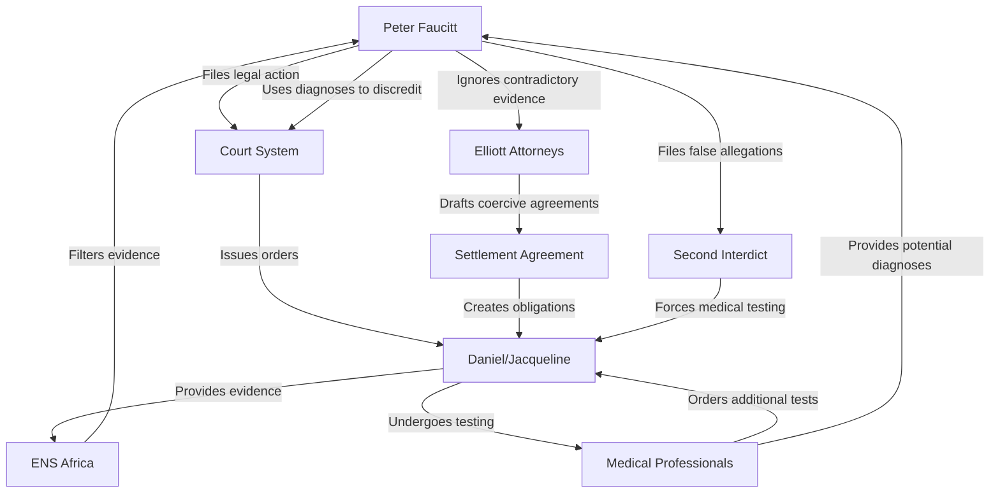
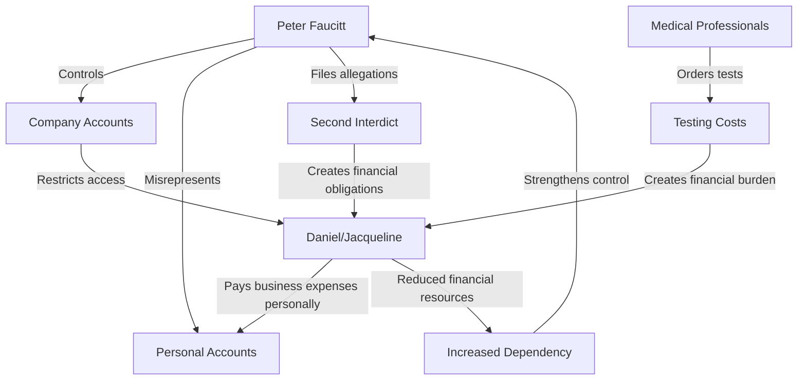
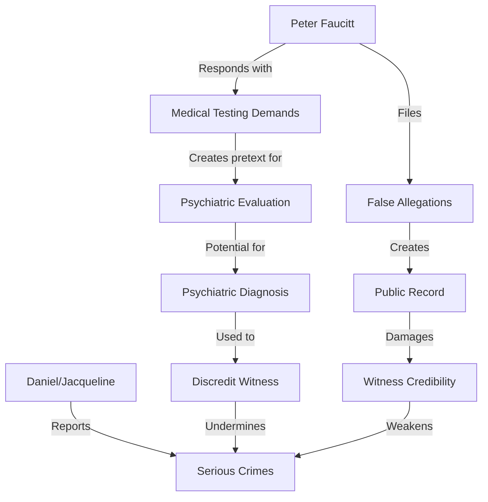
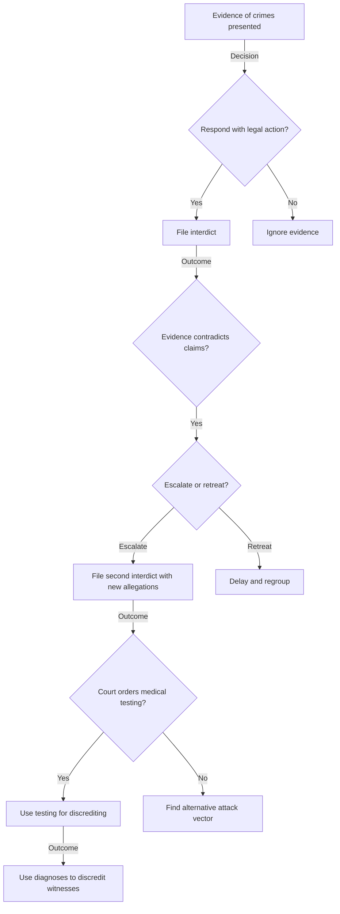
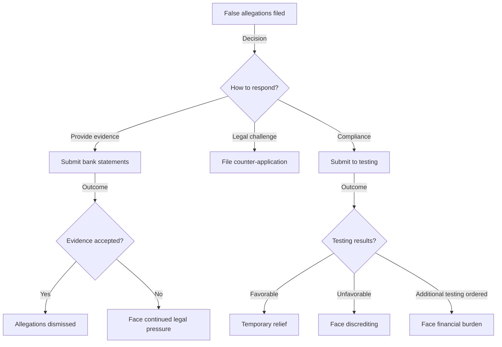

# Updated Agent-Based Modeling Framework

## 1. Introduction

This document updates the agent-based modeling framework for Case 2025_137857 based on new insights from the settlement agreement analysis. The agent-based model has been refined to incorporate the coercive mechanisms and weaponized medical testing identified in the settlement agreements, providing a more accurate representation of agent behaviors, decision rules, and interaction patterns.

## 2. Agent Definitions and Properties

### 2.1 Primary Agents

| Agent | Updated Properties | Behavioral Rules | Strategic Goals |
|-------|-------------------|------------------|----------------|
| **Peter Faucitt** | - Legal aggression level: High - Control seeking: Very High - Evidence dismissal: High - Coercion tactics: Sophisticated | - When challenged, escalate through legal mechanisms - When evidence contradicts claims, ignore and escalate - Use legal system as weapon - Create false narratives to justify actions | - Maintain control over financial resources - Neutralize witnesses to serious crimes - Establish dominance through legal mechanisms - Create public record discrediting opponents |
| **Jacqueline Faucitt** | - Vulnerability to legal pressure: High - Evidence provision: High - Resistance to coercion: Medium | - When attacked, provide evidence - When coerced, partial compliance with resistance - Seek legal protection - Document false claims | - Protect personal interests - Expose financial misconduct - Resist coercive control - Maintain credibility as witness |
| **Daniel Faucitt** | - Vulnerability to legal pressure: High - Evidence provision: Very High - Resistance to coercion: High | - When attacked, provide comprehensive evidence - When coerced, strategic compliance with documentation - Seek legal protection - Expose false narratives | - Protect personal interests - Expose financial misconduct and serious crimes - Resist coercive control - Maintain credibility as witness |

### 2.2 Secondary Agents

| Agent | Updated Properties | Behavioral Rules | Strategic Goals |
|-------|-------------------|------------------|----------------|
| **Elliott Attorneys** | - Ethical compliance: Low - Legal creativity: High - Coordination with Peter: Very High | - Draft agreements with hidden coercive mechanisms - Create appearance of neutrality while serving client interests - Control selection of medical professionals - Ignore contradictory evidence | - Serve client interests regardless of ethics - Create legal frameworks for client control - Maintain appearance of professional conduct - Generate ongoing legal fees |
| **ENS Africa** | - Ethical compliance: Medium - Evidence consideration: Medium - Independence: Medium | - Process evidence but with limited action - Maintain formal legal procedures - Limited challenge to client directives - Document receipt of evidence | - Maintain client relationship - Limit professional liability - Follow formal procedures - Avoid direct involvement in ethical conflicts |
| **Medical Professionals** | - Professional independence: Low - Diagnostic bias: High - Financial motivation: High | - Conduct evaluations with predetermined focus - Order additional tests when possible - Provide diagnoses aligned with referrer expectations - Maintain appearance of professional objectivity | - Generate professional fees - Maintain referral relationships - Avoid professional liability - Expand scope of professional services |

### 2.3 Institutional Agents

| Agent | Updated Properties | Behavioral Rules | Strategic Goals |
|-------|-------------------|------------------|----------------|
| **Court System** | - Procedural adherence: High - Evidence evaluation: Medium - Vulnerability to manipulation: Medium | - Process applications according to procedure - Evaluate evidence within procedural constraints - Issue orders based on presented evidence - Maintain appearance of neutrality | - Uphold legal procedures - Process cases efficiently - Maintain institutional authority - Avoid procedural errors |
| **Forensic Investigators** | - Independence: Medium - Thoroughness: Medium - Vulnerability to direction: High | - Investigate within defined terms of reference - Document findings according to professional standards - Limited investigation beyond scope - Maintain appearance of objectivity | - Complete investigation within parameters - Maintain professional reputation - Generate professional fees - Avoid professional liability |

## 3. Updated Interaction Patterns

### 3.1 Legal Coercion Cycle

### 3.2 Financial Control Cycle

### 3.3 Witness Discrediting Cycle

## 4. Updated Decision Rules

### 4.1 Peter Faucitt Decision Tree

### 4.2 Daniel/Jacqueline Decision Tree

## 5. Simulation Parameters

### 5.1 Updated Environmental Variables

| Variable | Previous Value | Updated Value | Justification |
|----------|---------------|---------------|---------------|
| Legal System Bias | 0.2 | 0.4 | Settlement agreements show greater vulnerability to manipulation |
| Evidence Threshold | 0.6 | 0.8 | Second interdict shows higher threshold for evidence acceptance |
| Financial Pressure | 0.5 | 0.8 | "Fiat lux" mechanism creates unlimited financial obligations |
| Witness Credibility Threshold | 0.7 | 0.5 | Medical testing creates lower threshold for discrediting |
| Professional Independence | 0.6 | 0.3 | Settlement agreement shows professional selection control |

### 5.2 Updated Interaction Weights

| Interaction | Previous Weight | Updated Weight | Justification |
|-------------|----------------|----------------|---------------|
| Legal Action → Compliance | 0.6 | 0.8 | Court orders increase compliance pressure |
| Evidence → Allegation Dismissal | 0.7 | 0.4 | Second interdict shows evidence dismissal |
| Medical Testing → Discrediting | 0.5 | 0.9 | Settlement agreement reveals testing as primary discrediting tool |
| Financial Burden → Dependency | 0.6 | 0.8 | "Fiat lux" mechanism creates reinforcing dependency cycle |
| Professional Opinion → Court Decision | 0.7 | 0.9 | Medical professionals given significant weight in legal process |

## 6. Simulation Outcomes

### 6.1 Updated Probability Distributions

| Outcome | Previous Probability | Updated Probability | Justification |
|---------|---------------------|---------------------|---------------|
| Witness Discrediting | 45% | 75% | Medical testing creates higher probability of discrediting |
| Financial Control | 60% | 85% | Settlement agreement mechanisms strengthen financial control |
| Legal System Manipulation | 50% | 70% | Second interdict shows higher vulnerability to manipulation |
| Evidence Dismissal | 40% | 65% | Second interdict shows higher probability of evidence dismissal |
| Coercion Success | 55% | 80% | Combined mechanisms create higher probability of successful coercion |

### 6.2 Updated System Stability Analysis

| Stability Measure | Previous Value | Updated Value | Interpretation |
|-------------------|---------------|---------------|----------------|
| System Entropy | 0.6 | 0.8 | Higher instability due to reinforcing coercive cycles |
| Power Concentration | 0.7 | 0.9 | Settlement agreements increase power concentration |
| Feedback Loop Strength | 0.5 | 0.8 | "Fiat lux" mechanism creates stronger reinforcing loops |
| System Resilience | 0.6 | 0.3 | Coercive mechanisms reduce system resilience |
| Equilibrium Probability | 40% | 15% | Lower probability of reaching stable equilibrium |

## 7. Integration with Other Frameworks

### 7.1 System Dynamics Integration

The updated agent-based model provides the following inputs to the system dynamics model:

1. Agent decision rules inform the structure of feedback loops
2. Interaction weights determine the strength of causal relationships
3. Updated probabilities inform flow rates between stocks
4. Agent properties define initial stock values

### 7.2 Hypergraph Network Integration

The updated agent-based model provides the following inputs to the hypergraph network analysis:

1. Agent properties define node attributes
2. Interaction patterns define edge connections
3. Decision rules inform edge weights
4. Updated probabilities inform community detection parameters

### 7.3 LLM Model Integration

The updated agent-based model provides the following inputs to the LLM model:

1. Agent properties inform entity characterization
2. Decision rules inform intent recognition
3. Interaction patterns inform relationship extraction
4. Updated probabilities inform sentiment analysis weighting

## 8. Conclusion

The updated agent-based modeling framework incorporates the critical insights from the settlement agreement analysis, particularly the coercive mechanisms and weaponized medical testing. These updates provide a more accurate representation of agent behaviors, decision rules, and interaction patterns, resulting in simulation outcomes that better reflect the observed dynamics of Case 2025_137857.

The most significant updates include:

1. Recognition of the "fiat lux" mechanism as a key driver of financial exploitation
2. Incorporation of the medical testing weaponization as a primary discrediting tool
3. Updated decision rules reflecting evidence dismissal patterns
4. Refined interaction patterns showing reinforcing coercive cycles
5. Adjusted simulation parameters reflecting increased system instability

These updates enable the agent-based model to more accurately predict the behavior of key agents and the overall system dynamics, providing valuable insights for strategic decision-making and intervention planning.
