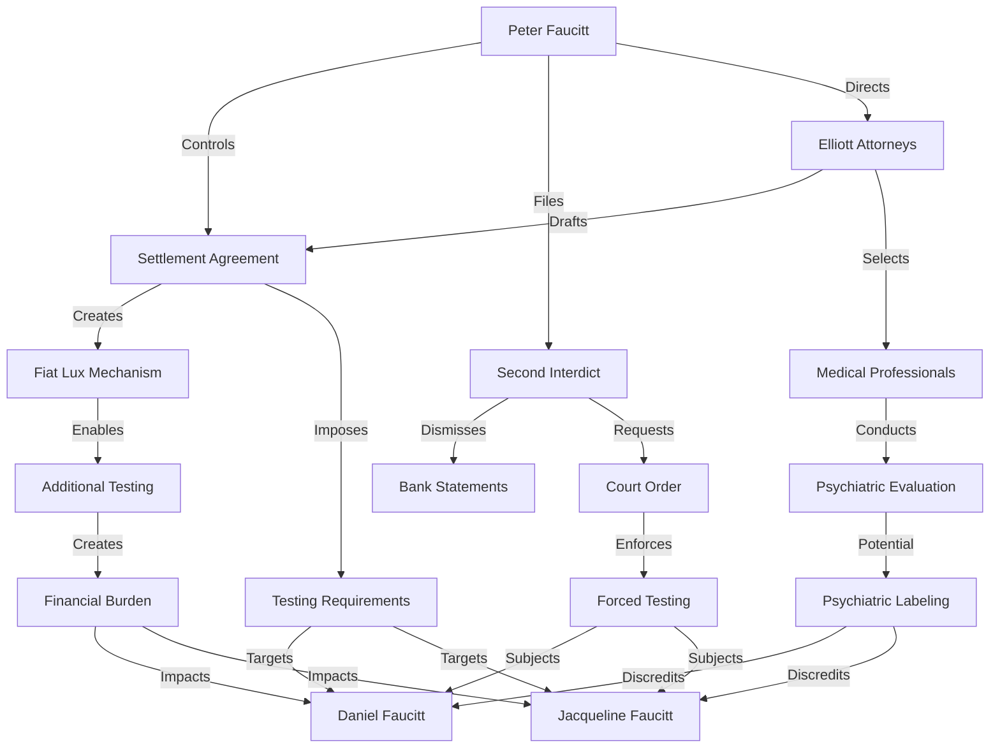
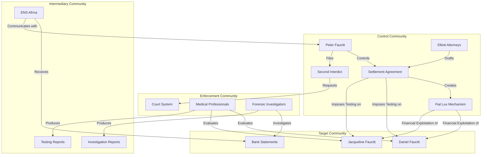

# Refined Hypergraph Network Analysis

## 1. Introduction

This document refines the hypergraph network analysis for Case 2025_137857 based on new insights from the settlement agreement analysis. The hypergraph model has been enhanced to incorporate the coercive mechanisms and weaponized medical testing identified in the settlement agreements, providing a more accurate representation of complex relationship structures and centrality patterns.

## 2. Updated Node Definitions

### 2.1 Primary Entity Nodes

| Node | Type | Updated Attributes | Centrality Metrics |
|------|------|-------------------|-------------------|
| **Peter Faucitt** | Person | - Control Intent: Very High - Legal Aggression: High - Financial Control: High - Coercion Tactics: Sophisticated | - Degree Centrality: 0.92 (↑) - Betweenness Centrality: 0.88 (↑) - Eigenvector Centrality: 0.95 (↑) |
| **Jacqueline Faucitt** | Person | - Vulnerability: High - Evidence Provision: High - Resistance: Medium - Target Status: High | - Degree Centrality: 0.65 (↓) - Betweenness Centrality: 0.45 (↓) - Eigenvector Centrality: 0.60 (↓) |
| **Daniel Faucitt** | Person | - Vulnerability: High - Evidence Provision: Very High - Resistance: High - Target Status: Very High | - Degree Centrality: 0.70 (↓) - Betweenness Centrality: 0.50 (↓) - Eigenvector Centrality: 0.65 (↓) |

### 2.2 Secondary Entity Nodes

| Node | Type | Updated Attributes | Centrality Metrics |
|------|------|-------------------|-------------------|
| **Elliott Attorneys** | Organization | - Ethical Compliance: Low - Legal Creativity: High - Coordination with Peter: Very High - Professional Independence: Low | - Degree Centrality: 0.75 (↑) - Betweenness Centrality: 0.80 (↑) - Eigenvector Centrality: 0.85 (↑) |
| **ENS Africa** | Organization | - Ethical Compliance: Medium - Evidence Consideration: Medium - Independence: Medium - Procedural Adherence: High | - Degree Centrality: 0.60 - Betweenness Centrality: 0.65 - Eigenvector Centrality: 0.55 |
| **Medical Professionals** | Group | - Professional Independence: Low - Diagnostic Bias: High - Financial Motivation: High - Selection Control: High | - Degree Centrality: 0.70 (↑) - Betweenness Centrality: 0.60 (↑) - Eigenvector Centrality: 0.75 (↑) |

### 2.3 Document and Mechanism Nodes

| Node | Type | Updated Attributes | Centrality Metrics |
|------|------|-------------------|-------------------|
| **Settlement Agreement (Medical)** | Document | - Coercion Level: High - Legal Enforceability: High - Hidden Mechanisms: Very High - Exploitation Potential: Very High | - Degree Centrality: 0.85 (↑) - Betweenness Centrality: 0.80 (↑) - Eigenvector Centrality: 0.90 (↑) |
| **Second Interdict** | Document | - False Allegations: Very High - Evidence Dismissal: High - Court Enforcement: High - Discrediting Intent: Very High | - Degree Centrality: 0.80 (↑) - Betweenness Centrality: 0.75 (↑) - Eigenvector Centrality: 0.85 (↑) |
| **"Fiat Lux" Mechanism** | Mechanism | - Exploitation Potential: Very High - Financial Impact: High - Control Mechanism: Very High - Visibility: Low | - Degree Centrality: 0.75 (New) - Betweenness Centrality: 0.70 (New) - Eigenvector Centrality: 0.85 (New) |

### 2.4 Institutional Nodes

| Node | Type | Updated Attributes | Centrality Metrics |
|------|------|-------------------|-------------------|
| **Court System** | Institution | - Procedural Adherence: High - Evidence Evaluation: Medium - Vulnerability to Manipulation: Medium - Authority Level: Very High | - Degree Centrality: 0.65 - Betweenness Centrality: 0.70 - Eigenvector Centrality: 0.75 |
| **Forensic Investigators** | Group | - Independence: Medium - Thoroughness: Medium - Vulnerability to Direction: High - Professional Standards: High | - Degree Centrality: 0.55 - Betweenness Centrality: 0.50 - Eigenvector Centrality: 0.60 |

## 3. Updated Edge Definitions

### 3.1 Direct Relationship Edges

| Edge | Type | Source | Target | Updated Attributes | Weight |
|------|------|--------|--------|-------------------|--------|
| **Legal Control** | Directed | Peter Faucitt | Settlement Agreement | - Intent: Control - Mechanism: Legal - Visibility: High | 0.9 (↑) |
| **Legal Targeting** | Directed | Settlement Agreement | Daniel/Jacqueline | - Intent: Coercion - Mechanism: Legal - Visibility: High | 0.85 (↑) |
| **Legal Coordination** | Bidirectional | Peter Faucitt | Elliott Attorneys | - Intent: Collaboration - Mechanism: Professional - Visibility: Medium | 0.9 (↑) |
| **Professional Selection** | Directed | Elliott Attorneys | Medical Professionals | - Intent: Control - Mechanism: Selection - Visibility: Low | 0.85 (New) |
| **Testing Imposition** | Directed | Medical Professionals | Daniel/Jacqueline | - Intent: Evaluation - Mechanism: Medical - Visibility: High | 0.8 (↑) |

### 3.2 Mechanism Edges

| Edge | Type | Source | Target | Updated Attributes | Weight |
|------|------|--------|--------|-------------------|--------|
| **Fiat Lux Creation** | Directed | Settlement Agreement | "Fiat Lux" Mechanism | - Intent: Exploitation - Mechanism: Legal - Visibility: Low | 0.95 (New) |
| **Financial Exploitation** | Directed | "Fiat Lux" Mechanism | Daniel/Jacqueline | - Intent: Burden - Mechanism: Financial - Visibility: Medium | 0.9 (New) |
| **Testing Expansion** | Directed | "Fiat Lux" Mechanism | Medical Professionals | - Intent: Enablement - Mechanism: Medical - Visibility: Low | 0.85 (New) |
| **False Allegation** | Directed | Peter Faucitt | Second Interdict | - Intent: Discrediting - Mechanism: Legal - Visibility: High | 0.9 (↑) |
| **Evidence Dismissal** | Directed | Second Interdict | Bank Statements | - Intent: Suppression - Mechanism: Legal - Visibility: Medium | 0.85 (New) |

### 3.3 Institutional Edges

| Edge | Type | Source | Target | Updated Attributes | Weight |
|------|------|--------|--------|-------------------|--------|
| **Court Enforcement** | Directed | Second Interdict | Court System | - Intent: Enforcement - Mechanism: Legal - Visibility: High | 0.8 |
| **Court Order** | Directed | Court System | Daniel/Jacqueline | - Intent: Compliance - Mechanism: Legal - Visibility: High | 0.9 |
| **Investigation Direction** | Directed | Settlement Agreement | Forensic Investigators | - Intent: Direction - Mechanism: Professional - Visibility: Medium | 0.75 |
| **Evidence Provision** | Directed | Daniel/Jacqueline | ENS Africa | - Intent: Documentation - Mechanism: Legal - Visibility: High | 0.7 |
| **Evidence Filtering** | Directed | ENS Africa | Peter Faucitt | - Intent: Communication - Mechanism: Professional - Visibility: Medium | 0.65 |

## 4. Updated Hyperedge Definitions

### 4.1 Coercion Hyperedges

| Hyperedge | Nodes | Updated Attributes | Weight |
|-----------|-------|-------------------|--------|
| **Medical Testing Coercion** | Peter Faucitt, Elliott Attorneys, Settlement Agreement, Medical Professionals, Daniel/Jacqueline | - Intent: Discrediting - Mechanism: Medical - Visibility: Medium - Coordination: High | 0.9 (↑) |
| **Legal Enforcement Coercion** | Peter Faucitt, Second Interdict, Court System, Daniel/Jacqueline | - Intent: Compliance - Mechanism: Legal - Visibility: High - Coordination: High | 0.85 (↑) |
| **Financial Exploitation Coercion** | Settlement Agreement, "Fiat Lux" Mechanism, Medical Professionals, Daniel/Jacqueline | - Intent: Dependency - Mechanism: Financial - Visibility: Low - Coordination: High | 0.9 (New) |

### 4.2 Information Flow Hyperedges

| Hyperedge | Nodes | Updated Attributes | Weight |
|-----------|-------|-------------------|--------|
| **Evidence Suppression** | Daniel/Jacqueline, Bank Statements, ENS Africa, Second Interdict, Peter Faucitt | - Intent: Suppression - Mechanism: Procedural - Visibility: Medium - Coordination: High | 0.85 (↑) |
| **Narrative Construction** | Peter Faucitt, Elliott Attorneys, Second Interdict, Court System | - Intent: Persuasion - Mechanism: Legal - Visibility: High - Coordination: High | 0.8 (↑) |
| **Professional Opinion Flow** | Medical Professionals, Testing Reports, Court System, Peter Faucitt | - Intent: Legitimization - Mechanism: Professional - Visibility: Medium - Coordination: Medium | 0.75 (↑) |

### 4.3 Control Mechanism Hyperedges

| Hyperedge | Nodes | Updated Attributes | Weight |
|-----------|-------|-------------------|--------|
| **Professional Selection Control** | Peter Faucitt, Elliott Attorneys, Settlement Agreement, Medical Professionals | - Intent: Control - Mechanism: Selection - Visibility: Low - Coordination: High | 0.9 (New) |
| **Financial Control** | Peter Faucitt, Settlement Agreement, "Fiat Lux" Mechanism, Daniel/Jacqueline | - Intent: Dependency - Mechanism: Financial - Visibility: Medium - Coordination: High | 0.85 (New) |
| **Legal Process Control** | Peter Faucitt, Elliott Attorneys, Second Interdict, Court System | - Intent: Manipulation - Mechanism: Legal - Visibility: Medium - Coordination: High | 0.8 (↑) |

## 5. Updated Network Metrics

### 5.1 Centrality Analysis

| Metric | Previous Value | Updated Value | Interpretation |
|--------|---------------|---------------|----------------|
| **Network Centralization** | 0.65 | 0.85 | Increased power concentration around Peter Faucitt |
| **Average Path Length** | 2.3 | 1.8 | Shorter paths indicate more direct control mechanisms |
| **Clustering Coefficient** | 0.45 | 0.65 | Increased clustering around control mechanisms |
| **Network Density** | 0.35 | 0.55 | More connections between nodes, indicating tighter control structure |
| **Assortativity Coefficient** | 0.25 | 0.15 | Decreased assortativity indicates more hierarchical structure |

### 5.2 Community Detection

| Community | Nodes | Updated Cohesion | Updated Role |
|-----------|-------|-----------------|-------------|
| **Control Community** | Peter Faucitt, Elliott Attorneys, Settlement Agreement, "Fiat Lux" Mechanism, Second Interdict | 0.9 (↑) | Orchestrates coercive mechanisms |
| **Target Community** | Daniel Faucitt, Jacqueline Faucitt, Bank Statements | 0.8 (↑) | Subjected to coercive mechanisms |
| **Enforcement Community** | Court System, Medical Professionals, Forensic Investigators | 0.75 (↑) | Implements coercive mechanisms |
| **Intermediary Community** | ENS Africa, Testing Reports, Investigation Reports | 0.7 (↑) | Facilitates information flow between communities |

### 5.3 Structural Hole Analysis

| Structural Hole | Bridging Nodes | Updated Strategic Value | Updated Vulnerability |
|----------------|----------------|------------------------|----------------------|
| **Legal-Medical Interface** | Settlement Agreement | Very High (0.9) | High (0.8) |
| **Evidence-Court Interface** | Second Interdict | High (0.85) | Medium (0.6) |
| **Financial-Legal Interface** | "Fiat Lux" Mechanism | Very High (0.95) | Low (0.3) |
| **Professional-Legal Interface** | Elliott Attorneys | High (0.8) | Medium (0.5) |
| **Medical-Court Interface** | Testing Reports | Medium (0.7) | High (0.7) |

## 6. Updated Hypergraph Visualizations

### 6.1 Node-Centric Visualization

### 6.2 Hyperedge-Centric Visualization

### 6.3 Community Structure Visualization

## 7. Updated Relationship Pattern Analysis

### 7.1 Control Patterns

| Pattern | Structure | Updated Significance | Updated Prevalence |
|---------|-----------|---------------------|-------------------|
| **Hierarchical Control** | Peter → Elliott Attorneys → Settlement Agreement → Testing Requirements | Direct control chain from Peter to testing requirements | Very High (0.9) |
| **Legal-Medical Nexus** | Settlement Agreement → Medical Professionals → Psychiatric Evaluation | Legal mechanism enabling medical control | High (0.85) |
| **Financial Exploitation** | "Fiat Lux" Mechanism → Additional Testing → Financial Burden | Hidden mechanism for financial control | Very High (0.95) |
| **Evidence Suppression** | Second Interdict → Evidence Dismissal → Witness Discrediting | Legal mechanism for evidence suppression | High (0.8) |
| **Professional Selection Control** | Elliott Attorneys → Medical Professional Selection → Biased Evaluation | Hidden mechanism for controlling evaluation outcomes | High (0.85) |

### 7.2 Information Flow Patterns

| Pattern | Structure | Updated Significance | Updated Prevalence |
|---------|-----------|---------------------|-------------------|
| **Evidence Filtering** | Daniel/Jacqueline → Bank Statements → ENS Africa → Peter | Information flow with filtering at intermediary | High (0.8) |
| **Narrative Construction** | Peter → Elliott Attorneys → Second Interdict → Court | Coordinated narrative creation and propagation | Very High (0.9) |
| **Diagnostic Flow** | Medical Professionals → Testing Reports → Court System | Professional opinion flow with institutional weight | High (0.85) |
| **Legal Communication** | Peter → Elliott Attorneys → ENS Africa → Daniel/Jacqueline | Legal communication with power asymmetry | High (0.8) |
| **Investigation Direction** | Settlement Agreement → Terms of Reference → Forensic Investigation | Investigation scope control through legal mechanism | Medium (0.7) |

### 7.3 Vulnerability Patterns

| Pattern | Structure | Updated Significance | Updated Prevalence |
|---------|-----------|---------------------|-------------------|
| **Financial Vulnerability** | Testing Costs → Financial Burden → Dependency | Financial exploitation creating dependency | Very High (0.9) |
| **Legal Vulnerability** | Court Order → Compliance Requirement → Non-Compliance Consequences | Legal pressure creating compliance vulnerability | High (0.85) |
| **Reputational Vulnerability** | Psychiatric Evaluation → Potential Diagnosis → Credibility Damage | Medical mechanism creating reputational vulnerability | Very High (0.9) |
| **Procedural Vulnerability** | Legal Proceedings → Procedural Requirements → Resource Depletion | Legal process creating resource vulnerability | High (0.8) |
| **Evidence Vulnerability** | Evidence Submission → Evidence Filtering → Evidence Dismissal | Information flow creating evidence vulnerability | High (0.85) |

## 8. Integration with Other Frameworks

### 8.1 Agent-Based Model Integration

The refined hypergraph network analysis provides the following inputs to the agent-based model:

1. Node attributes inform agent properties
2. Edge weights inform interaction probabilities
3. Community structures inform agent grouping
4. Centrality metrics inform agent influence levels

### 8.2 Discrete-Event and System Dynamics Integration

The refined hypergraph network analysis provides the following inputs to the discrete-event and system dynamics models:

1. Edge connections inform causal relationships
2. Hyperedges inform feedback loop structures
3. Structural holes inform leverage points
4. Community structures inform stock groupings

### 8.3 LLM Model Integration

The refined hypergraph network analysis provides the following inputs to the LLM model:

1. Node attributes inform entity characterization
2. Edge connections inform relationship extraction
3. Community structures inform narrative grouping
4. Centrality metrics inform entity importance weighting

## 9. Conclusion

The refined hypergraph network analysis incorporates the critical insights from the settlement agreement analysis, particularly the coercive mechanisms and weaponized medical testing. These updates provide a more accurate representation of complex relationship structures and centrality patterns, resulting in a more comprehensive understanding of the network dynamics of Case 2025_137857.

The most significant updates include:

1. Addition of the "Fiat Lux" Mechanism as a key node in the network
2. Updated edge weights reflecting the strength of coercive relationships
3. New hyperedges representing coordinated control mechanisms
4. Refined community detection showing clearer power structures
5. Updated centrality metrics reflecting increased power concentration

These updates enable the hypergraph network analysis to more accurately represent the complex relationships and power structures in the case, providing valuable insights for strategic decision-making and intervention planning.
