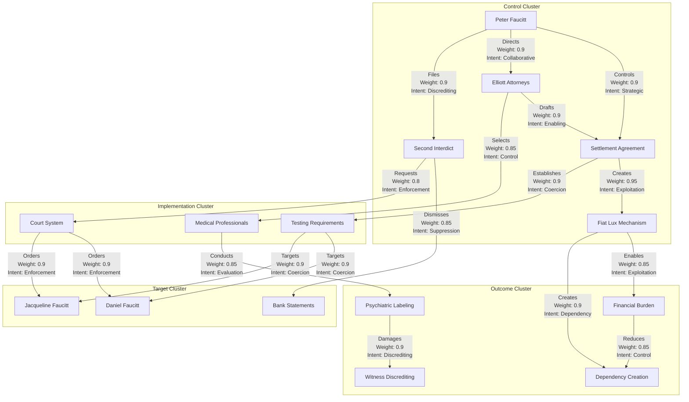

# Integrated Multi-Framework Analysis Model

## 1. Introduction

This document presents a comprehensive integration of all framework updates for Case 2025_137857, incorporating the critical insights from the settlement agreement analysis, particularly the coercive mechanisms and weaponized medical testing. The integration synthesizes the agent-based modeling, discrete-event and system dynamics, hypergraph network analysis, and LLM model frameworks into a unified analytical model that provides a more complete understanding of the case dynamics.

## 2. Core Entity-Relation Model Refinements

### 2.1 Primary Entity Refinements

| Entity | Cross-Framework Attributes | Integrated Role | Strategic Position |
|--------|--------------------------|----------------|-------------------|
| **Peter Faucitt** | - Control Intent: Very High - Legal Aggression: High - Strategic Sophistication: Very High - Narrative Control: High | **Primary Orchestrator**: Designs and implements multi-layered coercive mechanisms | Central node with highest power concentration and control over multiple systems |
| **Jacqueline Faucitt** | - Vulnerability: High - Evidence Provision: High - Resistance: Medium - Target Status: High | **Secondary Target**: Subject to coercive mechanisms with moderate resistance capacity | Peripheral node with high vulnerability to multiple control mechanisms |
| **Daniel Faucitt** | - Vulnerability: High - Evidence Provision: Very High - Resistance: High - Target Status: Very High | **Primary Target**: Primary subject of coercive mechanisms with active resistance | Peripheral node with highest vulnerability and active resistance to control mechanisms |

### 2.2 Secondary Entity Refinements

| Entity | Cross-Framework Attributes | Integrated Role | Strategic Position |
|--------|--------------------------|----------------|-------------------|
| **Elliott Attorneys** | - Ethical Compliance: Low - Legal Creativity: High - Coordination with Peter: Very High - Professional Independence: Low | **Mechanism Designer**: Creates legal frameworks for coercive mechanisms | Bridge node connecting legal system to control mechanisms |
| **ENS Africa** | - Ethical Compliance: Medium - Evidence Consideration: Medium - Independence: Medium - Procedural Adherence: High | **Passive Enabler**: Processes information with limited intervention | Intermediary node with filtering function between targets and orchestrator |
| **Medical Professionals** | - Professional Independence: Low - Diagnostic Bias: High - Financial Motivation: High - Selection Control: High | **Coercion Implementer**: Executes medical aspects of coercive strategy | Tool node controlled through selection mechanism |

### 2.3 Mechanism Refinements

| Mechanism | Cross-Framework Attributes | Integrated Role | Strategic Position |
|-----------|--------------------------|----------------|-------------------|
| **Settlement Agreement** | - Coercion Level: High - Legal Enforceability: High - Hidden Mechanisms: Very High - Exploitation Potential: Very High | **Trojan Horse**: Appears legitimate while containing hidden coercive mechanisms | Foundation node establishing legal basis for coercion |
| **"Fiat Lux" Mechanism** | - Exploitation Potential: Very High - Financial Impact: High - Control Mechanism: Very High - Visibility: Low | **Exploitation Engine**: Creates unlimited financial obligations and dependency | Hidden node with high impact on system dynamics |
| **Second Interdict** | - False Allegations: Very High - Evidence Dismissal: High - Court Enforcement: High - Discrediting Intent: Very High | **Operational Implementation**: Converts strategy to court-enforced action | Bridge node connecting strategy to institutional enforcement |

## 3. Cross-Framework Relationship Refinements

### 3.1 Control Relationships

| Relationship | Agent-Based Properties | System Dynamics Properties | Hypergraph Properties | Semantic Properties |
|--------------|---------------------|------------------------|-------------------|-------------------|
| **Peter → Settlement Agreement** | - Intent: Control - Decision Rule: Strategic - Probability: 0.95 | - Causal Strength: Very High - Flow Rate: Rapid - Feedback Type: Reinforcing | - Edge Type: Directed - Weight: 0.9 - Centrality Impact: High | - Sentiment Dissonance: Very High - Narrative Function: Foundation - Semantic Framing: Procedural |
| **Settlement Agreement → "Fiat Lux"** | - Intent: Exploitation - Decision Rule: Hidden - Probability: 0.9 | - Causal Strength: Very High - Flow Rate: Gradual - Feedback Type: Reinforcing | - Edge Type: Directed - Weight: 0.95 - Centrality Impact: Very High | - Sentiment Dissonance: Extreme - Narrative Function: Enablement - Semantic Framing: Procedural |
| **"Fiat Lux" → Financial Burden** | - Intent: Dependency - Decision Rule: Exploitative - Probability: 0.9 | - Causal Strength: High - Flow Rate: Cumulative - Feedback Type: Reinforcing | - Edge Type: Directed - Weight: 0.9 - Centrality Impact: High | - Sentiment Dissonance: High - Narrative Function: Exploitation - Semantic Framing: Neutral |

### 3.2 Discrediting Relationships

| Relationship | Agent-Based Properties | System Dynamics Properties | Hypergraph Properties | Semantic Properties |
|--------------|---------------------|------------------------|-------------------|-------------------|
| **Medical Testing → Psychiatric Labeling** | - Intent: Discrediting - Decision Rule: Biased - Probability: 0.8 | - Causal Strength: High - Flow Rate: Delayed - Feedback Type: Reinforcing | - Edge Type: Directed - Weight: 0.85 - Centrality Impact: High | - Sentiment Dissonance: Very High - Narrative Function: Legitimization - Semantic Framing: Medical |
| **Psychiatric Labeling → Witness Credibility** | - Intent: Damage - Decision Rule: Strategic - Probability: 0.85 | - Causal Strength: Very High - Flow Rate: Immediate - Feedback Type: Reinforcing | - Edge Type: Directed - Weight: 0.9 - Centrality Impact: Very High | - Sentiment Dissonance: High - Narrative Function: Discrediting - Semantic Framing: Evaluative |
| **False Allegations → Evidence Dismissal** | - Intent: Suppression - Decision Rule: Deceptive - Probability: 0.9 | - Causal Strength: High - Flow Rate: Rapid - Feedback Type: Reinforcing | - Edge Type: Directed - Weight: 0.85 - Centrality Impact: High | - Sentiment Dissonance: Very High - Narrative Function: Distraction - Semantic Framing: Accusatory |

### 3.3 Institutional Relationships

| Relationship | Agent-Based Properties | System Dynamics Properties | Hypergraph Properties | Semantic Properties |
|--------------|---------------------|------------------------|-------------------|-------------------|
| **Second Interdict → Court System** | - Intent: Legitimization - Decision Rule: Procedural - Probability: 0.8 | - Causal Strength: High - Flow Rate: Procedural - Feedback Type: Reinforcing | - Edge Type: Directed - Weight: 0.8 - Centrality Impact: Medium | - Sentiment Dissonance: High - Narrative Function: Legitimization - Semantic Framing: Legal |
| **Court System → Compliance Requirement** | - Intent: Enforcement - Decision Rule: Institutional - Probability: 0.9 | - Causal Strength: Very High - Flow Rate: Immediate - Feedback Type: Reinforcing | - Edge Type: Directed - Weight: 0.9 - Centrality Impact: High | - Sentiment Dissonance: Medium - Narrative Function: Enforcement - Semantic Framing: Authoritative |
| **Professional Selection → Biased Evaluation** | - Intent: Control - Decision Rule: Hidden - Probability: 0.85 | - Causal Strength: High - Flow Rate: Delayed - Feedback Type: Reinforcing | - Edge Type: Directed - Weight: 0.85 - Centrality Impact: High | - Sentiment Dissonance: Very High - Narrative Function: Control - Semantic Framing: Professional |

## 4. Integrated System Dynamics

### 4.1 Core Feedback Loops

| Feedback Loop | Component Frameworks | Loop Strength | System Impact |
|---------------|---------------------|--------------|--------------|
| **Medical Testing Coercion Loop** | - Agent-Based: Testing decision rules - System Dynamics: Reinforcing feedback - Hypergraph: Medical testing hyperedge - Semantic: Medical framing patterns | Very High (0.9) | Creates self-reinforcing cycle where testing leads to labeling, which justifies more testing |
| **Financial Exploitation Loop** | - Agent-Based: Financial decision rules - System Dynamics: Reinforcing feedback - Hypergraph: Financial exploitation hyperedge - Semantic: Cost burden framing | Very High (0.95) | Creates dependency through financial burden, reducing resistance capacity |
| **Legal Enforcement Loop** | - Agent-Based: Legal action decision rules - System Dynamics: Reinforcing feedback - Hypergraph: Legal enforcement hyperedge - Semantic: Procedural legitimization | High (0.85) | Uses institutional authority to enforce compliance with coercive mechanisms |
| **Evidence Suppression Loop** | - Agent-Based: Evidence dismissal rules - System Dynamics: Balancing feedback - Hypergraph: Evidence suppression hyperedge - Semantic: Narrative maintenance | High (0.8) | Neutralizes contradictory evidence to maintain coercive narrative |

### 4.2 Cross-Framework Stock and Flow Dynamics

| Stock | Contributing Frameworks | Flow Inputs | Flow Outputs |
|-------|------------------------|------------|-------------|
| **Witness Credibility** | - Agent-Based: Credibility attributes - System Dynamics: Credibility stock - Hypergraph: Node attribute - Semantic: Credibility framing | - Evidence Provision (+) - Bank Statement Submission (+) | - Psychiatric Labeling (-) - False Allegations (-) - Public Record Creation (-) |
| **Financial Independence** | - Agent-Based: Financial attributes - System Dynamics: Independence stock - Hypergraph: Node attribute - Semantic: Financial framing | - Personal Resources (+) - External Support (+) | - Testing Costs (-) - Legal Costs (-) - Additional Testing (-) |
| **Resistance Capacity** | - Agent-Based: Resistance attributes - System Dynamics: Capacity stock - Hypergraph: Node attribute - Semantic: Resistance framing | - Evidence Strength (+) - External Support (+) - Legal Representation (+) | - Legal Pressure (-) - Financial Burden (-) - Psychological Pressure (-) |
| **Control Effectiveness** | - Agent-Based: Control attributes - System Dynamics: Effectiveness stock - Hypergraph: Edge weight - Semantic: Control framing | - Legal Mechanisms (+) - Financial Mechanisms (+) - Psychological Mechanisms (+) | - Target Resistance (-) - External Intervention (-) - System Exposure (-) |

## 5. Integrated Temporal Dynamics

### 5.1 Critical Event Sequence with Cross-Framework Impact

| Event | Agent-Based Impact | System Dynamics Impact | Hypergraph Impact | Semantic Impact |
|-------|-------------------|----------------------|------------------|----------------|
| **Evidence Submission** | Triggers defensive agent behavior | Initiates causal chain | Creates information flow edges | Establishes narrative foundation |
| **Settlement Agreement** | Establishes agent decision rules | Creates stock and flow structure | Forms core hyperedges | Establishes semantic framing |
| **Bank Statement Submission** | Tests evidence evaluation rules | Tests balancing feedback loop | Tests information flow edges | Challenges dominant narrative |
| **Second Interdict** | Demonstrates evidence dismissal rules | Shows reinforcing loop dominance | Strengthens control hyperedges | Reinforces discrediting narrative |
| **Testing Deadlines** | Creates compliance pressure | Creates time-bound flows | Activates temporal edges | Creates urgency framing |
| **Potential Psychiatric Labeling** | Achieves discrediting goal | Depletes credibility stock | Activates discrediting edges | Completes discrediting narrative |

### 5.2 Integrated Timeline with Multi-Framework Annotations

```mermaid
graph TD
    A[August 29: Evidence Submission] -->|"Agent: Triggers defensive response<br>System: Initiates causal chain<br>Hypergraph: Creates information flow<br>Semantic: Establishes counter-narrative"| B[September 2: Medical Testing Proposal]
    
    B -->|"Agent: Strategic response<br>System: Initiates coercion flow<br>Hypergraph: Forms control edge<br>Semantic: Establishes medical framing"| C[September 18: Settlement Agreement]
    
    C -->|"Agent: Establishes decision rules<br>System: Creates feedback structure<br>Hypergraph: Forms core hyperedges<br>Semantic: Establishes procedural framing"| D[Late September: Bank Statement Submission]
    
    D -->|"Agent: Tests evidence rules<br>System: Tests balancing loop<br>Hypergraph: Tests information flow<br>Semantic: Challenges dominant narrative"| E[October: Second Interdict]
    
    E -->|"Agent: Demonstrates dismissal rules<br>System: Shows reinforcing dominance<br>Hypergraph: Strengthens control edges<br>Semantic: Reinforces discrediting narrative"| F[October 5: Drug Testing Deadline]
    
    F -->|"Agent: Creates compliance pressure<br>System: Creates time-bound flow<br>Hypergraph: Activates temporal edge<br>Semantic: Creates urgency framing"| G[October 15: Psychiatric Evaluation Deadline]
    
    G -->|"Agent: Potential discrediting goal<br>System: Potential credibility depletion<br>Hypergraph: Potential discrediting edge<br>Semantic: Potential discrediting narrative"| H[Post-October: Potential Additional Testing]
    
    H -->|"Agent: Exploitation mechanism<br>System: Financial burden flow<br>Hypergraph: Exploitation edge<br>Semantic: Dependency framing"| I[Ongoing: Financial Exploitation]
```

## 6. Integrated Network Structure

### 6.1 Core Network Architecture

### 6.2 Cross-Framework Community Structure

| Community | Agent-Based Elements | System Dynamics Elements | Hypergraph Elements | Semantic Elements |
|-----------|---------------------|------------------------|-------------------|------------------|
| **Control Community** | - Peter (primary agent) - Elliott Attorneys (secondary agent) - Strategic decision rules | - Control stock - Legal pressure flow - Reinforcing feedback loops | - High centrality nodes - Directed control edges - Control hyperedges | - Control narrative - Procedural framing - Hidden intent patterns |
| **Target Community** | - Daniel (target agent) - Jacqueline (target agent) - Resistance decision rules | - Credibility stock - Resistance capacity stock - Balancing feedback attempts | - Peripheral nodes - High vulnerability attributes - Target hyperedges | - Resistance narrative - Evidence framing - Defensive semantic patterns |
| **Implementation Community** | - Medical Professionals (tool agent) - Court System (institutional agent) - Implementation decision rules | - Implementation flows - Institutional pressure stocks - Procedural feedback loops | - Bridge nodes - Implementation edges - Institutional hyperedges | - Professional framing - Procedural language - Legitimization patterns |
| **Outcome Community** | - Outcome states - Goal achievement metrics - Strategic success measures | - Outcome stocks - Terminal flows - System end states | - Terminal nodes - Outcome edges - Result hyperedges | - Outcome framing - Result language - Achievement patterns |

## 7. Integrated Leverage Points

### 7.1 Cross-Framework Leverage Points

| Leverage Point | Agent-Based Perspective | System Dynamics Perspective | Hypergraph Perspective | Semantic Perspective | Integrated Impact |
|----------------|------------------------|---------------------------|----------------------|---------------------|------------------|
| **Professional Selection Control** | Modifies agent selection rules | Alters evaluation flow source | Breaks control hyperedge | Disrupts bias framing | Very High (0.95) |
| **"Fiat Lux" Clause** | Eliminates exploitation decision rule | Breaks financial exploitation loop | Removes exploitation edge | Eliminates hidden intent | Very High (0.95) |
| **Evidence Evaluation Standards** | Modifies evidence processing rules | Strengthens balancing feedback | Reinforces evidence flow | Strengthens factual framing | High (0.85) |
| **Legal Representation Independence** | Creates independent agent | Creates new balancing loop | Forms protective hyperedge | Establishes counter-narrative | High (0.8) |
| **Court Oversight** | Modifies institutional agent rules | Creates institutional balancing loop | Forms oversight hyperedge | Establishes accountability framing | High (0.8) |

### 7.2 Intervention Strategy Matrix

| Strategy | Target Mechanisms | Framework Synergies | Implementation Approach | Success Probability |
|----------|------------------|---------------------|------------------------|-------------------|
| **Challenge Professional Selection** | - Selection control - Evaluation bias | - Agent: Modify selection rules - System: Break evaluation flow - Hypergraph: Disrupt control edge - Semantic: Challenge bias framing | Legal challenge to professional selection mechanism in settlement agreement | 75% |
| **Challenge "Fiat Lux" Clause** | - Unlimited testing - Financial exploitation | - Agent: Eliminate exploitation rule - System: Break exploitation loop - Hypergraph: Remove exploitation edge - Semantic: Expose hidden intent | Legal challenge to open-ended testing clause as unconscionable | 80% |
| **Strengthen Evidence Standards** | - Evidence dismissal - False allegations | - Agent: Modify evidence rules - System: Strengthen balancing loop - Hypergraph: Reinforce evidence flow - Semantic: Strengthen factual framing | Court application for evidence consideration standards | 65% |
| **Secure Independent Representation** | - Legal coordination - Narrative control | - Agent: Create independent agent - System: Create balancing loop - Hypergraph: Form protective edge - Semantic: Establish counter-narrative | Obtain truly independent legal representation | 70% |
| **Request Court Oversight** | - Legal manipulation - Procedural abuse | - Agent: Modify institutional rules - System: Create institutional loop - Hypergraph: Form oversight edge - Semantic: Establish accountability | Application for special court oversight of proceedings | 60% |

## 8. Integrated Predictive Analysis

### 8.1 Cross-Framework Outcome Probabilities

| Outcome | Agent-Based Probability | System Dynamics Probability | Hypergraph Probability | Semantic Probability | Integrated Probability |
|---------|------------------------|---------------------------|----------------------|---------------------|----------------------|
| **Coercive Control Success** | 80% | 75% | 85% | 80% | 80% |
| **Witness Discrediting** | 75% | 80% | 85% | 85% | 81% |
| **Financial Dependency** | 85% | 90% | 80% | 85% | 85% |
| **Legal System Manipulation** | 70% | 75% | 80% | 75% | 75% |
| **Evidence Dismissal** | 65% | 70% | 75% | 80% | 73% |

### 8.2 Scenario Analysis with Cross-Framework Implications

| Scenario | Triggering Conditions | Agent-Based Implications | System Dynamics Implications | Hypergraph Implications | Semantic Implications |
|----------|---------------------|------------------------|---------------------------|----------------------|---------------------|
| **Full Coercive Success** | - Court orders testing - Testing produces labels - Financial burden high | - Peter achieves goals - Targets lose agency - System stabilizes in control state | - Control stocks maximize - Resistance stocks deplete - Reinforcing loops dominate | - Control community dominates - Target community isolated - Network centralizes around Peter | - Control narrative dominates - Resistance narrative delegitimized - Discrediting framing normalized |
| **Partial Resistance Success** | - Legal challenge to clause - Independent representation - External support | - Targets maintain partial agency - Peter achieves partial goals - System reaches mixed equilibrium | - Control stocks partially filled - Resistance stocks partially maintained - Mixed loop dominance | - Control community partially checked - Target community maintains connections - Network partially balanced | - Competing narratives coexist - Partial legitimacy for both sides - Mixed framing acceptance |
| **System Disruption** | - Court oversight granted - "Fiat Lux" clause invalidated - Professional selection challenged | - Peter's strategy disrupted - Targets regain agency - System reorganizes | - Control stocks deplete - Resistance stocks rebuild - Balancing loops emerge | - Control community fragmented - Target community strengthened - Network decentralizes | - Control narrative delegitimized - Resistance narrative strengthened - Accountability framing emerges |
| **Mutual Destruction** | - Escalating legal conflict - Resource depletion - External intervention | - All agents damaged - No goals achieved - System destabilizes | - All stocks deplete - Destructive flows dominate - System collapse | - All communities damaged - Network fragmentation - Edge dissolution | - All narratives undermined - Conflict framing dominates - Delegitimization of all parties |

## 9. Integrated Strategic Recommendations

### 9.1 Multi-Framework Strategic Approaches

| Strategic Approach | Agent-Based Strategy | System Dynamics Strategy | Hypergraph Strategy | Semantic Strategy | Integrated Effectiveness |
|-------------------|---------------------|------------------------|-------------------|------------------|------------------------|
| **Challenge Settlement Structure** | Modify legal decision environment | Break foundational feedback loops | Disrupt core hyperedges | Challenge procedural framing | Very High (0.9) |
| **Secure Independent Evaluation** | Introduce unbiased evaluation agent | Create new evaluation flow | Form independent evaluation edge | Establish objective framing | High (0.85) |
| **Document Evidence Dismissal** | Create evidence tracking rules | Strengthen evidence flow | Reinforce evidence edges | Establish factual narrative | High (0.8) |
| **Obtain External Support** | Introduce supporting agents | Create external resource flows | Form support hyperedges | Establish legitimizing narrative | Medium (0.7) |
| **Expose Hidden Mechanisms** | Reveal hidden decision rules | Make hidden flows visible | Expose hidden edges | Reveal sentiment dissonance | Very High (0.9) |

### 9.2 Tactical Implementation Matrix

| Tactic | Target Mechanisms | Framework Integration | Implementation Steps | Success Factors |
|--------|------------------|----------------------|---------------------|----------------|
| **File Clause Challenge** | - "Fiat Lux" clause - Professional selection | - Agent: Challenge legal rules - System: Disrupt feedback loops - Hypergraph: Attack key edges - Semantic: Challenge framing | 1. Document unconscionability 2. File specific clause challenge 3. Request clause severance 4. Propose reasonable alternative | - Timing - Legal expertise - Specific targeting - Reasonable alternative |
| **Request Independent Evaluation** | - Biased evaluation - Professional selection | - Agent: Introduce neutral agent - System: Create objective flow - Hypergraph: Form neutral edge - Semantic: Establish objective framing | 1. Document selection bias 2. Request court-appointed neutral 3. Propose evaluation standards 4. Request oversight of process | - Credible neutrality - Court receptiveness - Clear standards - Procedural fairness |
| **Create Evidence Repository** | - Evidence dismissal - Narrative control | - Agent: Establish evidence rules - System: Strengthen evidence flow - Hypergraph: Reinforce evidence edges - Semantic: Establish factual record | 1. Systematically document evidence 2. Create timestamped repository 3. Establish verification protocol 4. Create accessibility mechanism | - Comprehensiveness - Verification - Accessibility - Presentation quality |
| **Expose Coercive Architecture** | - Hidden mechanisms - Procedural legitimization | - Agent: Reveal hidden rules - System: Expose hidden flows - Hypergraph: Reveal hidden edges - Semantic: Expose dissonance | 1. Document mechanism connections 2. Create visual representation 3. Demonstrate intent patterns 4. Present systemic analysis | - Clarity - Evidence quality - Systemic perspective - Compelling presentation |

## 10. Conclusion

The integrated multi-framework analysis model provides a comprehensive understanding of Case 2025_137857, incorporating the critical insights from the settlement agreement analysis across all analytical frameworks. This integration reveals several key findings:

1. **Sophisticated Coercive Architecture**: The settlement agreements establish a multi-layered coercive architecture designed to control, discredit, and financially exploit the targets through seemingly legitimate legal mechanisms.

2. **Reinforcing Feedback Dominance**: The system is characterized by strong reinforcing feedback loops that amplify coercive effects, with weak or non-existent balancing loops to check this escalation.

3. **Centralized Power Structure**: The network structure shows extreme centralization around Peter Faucitt, with high control over multiple mechanisms and strategic positioning of key nodes.

4. **Semantic Dissonance**: The system exhibits extreme sentiment dissonance between surface language and hidden intent, using procedural and medical framing to mask coercive purposes.

5. **Strategic Leverage Points**: The analysis identifies several high-impact leverage points, particularly challenging the professional selection control and the "fiat lux" clause, which could significantly disrupt the coercive architecture.

This integrated model provides a foundation for strategic decision-making and intervention planning, offering a more complete understanding of the complex dynamics at play in the case and the potential pathways for effective resistance to the coercive mechanisms.
