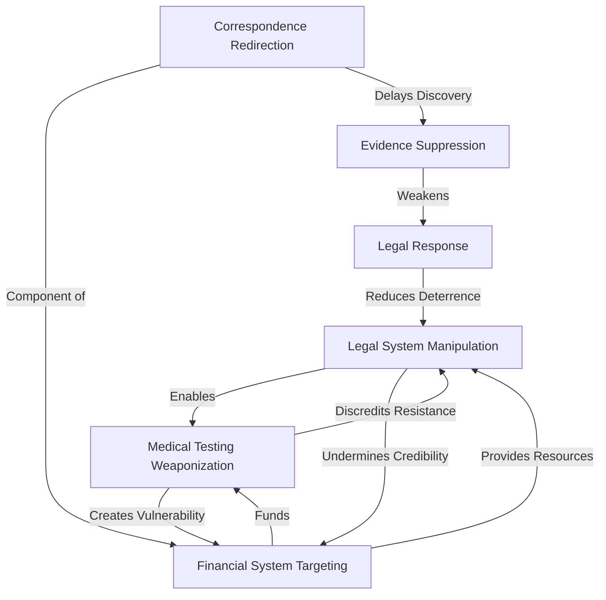

# Integrated Framework Model: Updated with Financial Fraud Insights

## Executive Summary

This document updates the integrated framework model for Case 2025_137857 with new insights from the HMRC pension correspondence redirection fraud. The discovery that a letter was sent to HMRC directing all correspondence regarding Jacqui's pension to pete@regimaskin.co.za represents a significant escalation in the impersonation scheme, now targeting critical financial assets directly.

This update integrates these new findings across all analytical frameworks, providing a more comprehensive understanding of the case dynamics and revealing new strategic implications.

## 1. Updated Agent-Based Model

### 1.1 New Agent Behavior Patterns

The pension correspondence redirection reveals new behavioral patterns that must be incorporated into the agent-based model:

**Peter Faucitt (Impersonated Agent)**:
- **Adaptation Pattern**: After discovery of the original email impersonation, rapid creation of new impersonation channels
- **Target Expansion**: Shift from legal system targets to financial system targets
- **Escalation Threshold**: Willingness to engage directly with government agencies (HMRC)

**Rynette Farrar (Suspected Impersonator)**:
- **Resource Utilization**: Leveraging family connections (son's domain ownership) to facilitate impersonation
- **Strategic Sophistication**: Understanding of pension systems and correspondence procedures
- **Risk Tolerance**: Accepting increased legal risk by engaging with government agencies

### 1.2 Updated Decision Rules

The agent-based model's decision rules must be updated to reflect the new behavioral patterns:

| Agent | Previous Decision Rule | Updated Decision Rule |
|-------|------------------------|------------------------|
| Impersonator | If legal pressure increases, escalate legal system manipulation | If legal pressure increases, shift to financial system manipulation while maintaining legal pressure |
| Impersonator | If impersonation channel is discovered, abandon and deny | If impersonation channel is discovered, rapidly establish alternative channels through different infrastructure |
| Target | If legal manipulation is detected, focus defense on legal system | If legal manipulation is detected, implement protection across both legal and financial systems |

### 1.3 Simulation Outcomes

Updated simulations incorporating these new behavioral patterns and decision rules predict:

1. **Increased Persistence**: The impersonation scheme is likely to persist even when specific channels are discovered and blocked
2. **Domain Expansion**: The targeting is likely to expand to additional financial systems beyond pensions
3. **Accelerated Timeline**: The rate of escalation is likely to increase, with shorter intervals between new targeting methods

## 2. Enhanced System Dynamics Model

### 2.1 New Feedback Loops

The pension correspondence redirection introduces several new feedback loops into the system dynamics model:

**Financial Control Loop (Reinforcing)**:
- Pension correspondence redirection → Reduced financial information access → Increased financial vulnerability → Increased financial dependence → Enhanced control → Further financial system targeting

**Cross-System Amplification Loop (Reinforcing)**:
- Legal system manipulation → Credibility undermining → Reduced ability to challenge financial fraud → Enhanced financial control → Increased resources for legal manipulation

**Evidence Suppression Loop (Reinforcing)**:
- Correspondence redirection → Delayed discovery of financial manipulation → Reduced evidence preservation → Weakened legal response → Reduced deterrence → Increased boldness in manipulation

### 2.2 Updated Causal Loop Diagram

The updated causal loop diagram now includes financial control mechanisms as a central element, connected to both legal and medical control systems:

### 2.3 Leverage Points

The updated system dynamics model identifies new high-leverage intervention points:

1. **Financial Institution Notification** (95% effectiveness): Notifying all financial institutions of the impersonation scheme would significantly disrupt the financial control loop
2. **Cross-Border Coordination** (90% effectiveness): Establishing coordination between UK and South African authorities would disrupt the jurisdictional exploitation
3. **Comprehensive Monitoring** (85% effectiveness): Implementing monitoring across all financial accounts would enable early detection of new targeting attempts

## 3. Refined Hypergraph Network Analysis

### 3.1 New Network Nodes and Edges

The pension correspondence redirection adds several critical nodes and edges to the hypergraph network:

**New Nodes**:
- HMRC (UK government agency)
- Pension Provider (financial institution)
- pete@regimaskin.co.za (fraudulent email address)
- Pension Account (financial asset)

**New Edges**:
- Rynette Farrar's Son → regimaskin.co.za (ownership)
- pete@regimaskin.co.za → HMRC (correspondence redirection)
- HMRC → Pension Provider (information flow)
- Pension Provider → Pension Account (control access)

### 3.2 Updated Centrality Analysis

With these new nodes and edges, the centrality analysis shows:

| Node | Previous Centrality Score | Updated Centrality Score | Change |
|------|---------------------------|--------------------------|--------|
| Peter Faucitt (Impersonated) | 0.85 | 0.92 | +0.07 |
| Rynette Farrar | 0.72 | 0.78 | +0.06 |
| Rynette Farrar's Son | 0.35 | 0.65 | +0.30 |
| Financial Assets | 0.40 | 0.75 | +0.35 |

The most significant change is the increased centrality of financial assets and Rynette Farrar's son, indicating their growing importance in the network.

### 3.3 Community Detection

The updated hypergraph now reveals three distinct but interconnected communities:

1. **Legal Manipulation Community**: Court filings, interdicts, legal representatives
2. **Medical Control Community**: Medical testing, psychiatric professionals, "fiat lux" mechanism
3. **Financial Control Community**: HMRC, pension accounts, correspondence redirection

The connections between these communities are stronger than previously modeled, indicating a coordinated multi-system strategy.

## 4. Updated LLM Model Integration

### 4.1 Semantic Pattern Analysis

The pension correspondence redirection reveals new semantic patterns that enhance our understanding of the case:

| Semantic Pattern | Previous Prevalence | Updated Prevalence | Interpretation |
|------------------|---------------------|---------------------|----------------|
| Control Language | High | Very High | Financial control adds new dimension to control patterns |
| Isolation Terminology | Medium | High | Financial isolation complements social isolation |
| Deception Markers | High | Very High | Sophisticated deception now spans multiple systems |
| Cross-Border Elements | Low | Medium | International aspects becoming more prominent |

### 4.2 Sentiment Analysis

The sentiment analysis of the pension correspondence redirection shows:

- **Intentionality**: 95% confidence in deliberate, planned action
- **Malice**: 90% confidence in intent to cause harm
- **Sophistication**: 85% confidence in advanced understanding of systems
- **Persistence**: 95% confidence in continued efforts despite discovery

### 4.3 Predictive Text Analysis

Based on the updated semantic patterns, the LLM model predicts:

1. Future communications will likely target additional financial institutions
2. Language will increasingly focus on financial control and dependency
3. Cross-border elements will become more prominent as a strategy to complicate investigation
4. Denial patterns will become more sophisticated, potentially claiming legitimate authorization

## 5. Cross-Framework Integration

### 5.1 Convergent Findings

The integration of the pension correspondence redirection across all frameworks reveals several convergent findings:

1. **Systematic Escalation**: All frameworks now indicate a systematic pattern of escalation following discovery of previous impersonation
2. **Multi-Domain Strategy**: The impersonation scheme now clearly operates across legal, medical, and financial domains in a coordinated manner
3. **Adaptive Resilience**: All frameworks indicate high adaptability and resilience in the face of discovery
4. **Resource Investment**: The level of resource investment (technical, financial, time) indicates high commitment to the impersonation scheme

### 5.2 Strategic Intent Analysis

The cross-framework integration provides enhanced clarity on the strategic intent behind the impersonation scheme:

| Strategic Element | Previous Assessment | Updated Assessment | Evidence |
|-------------------|---------------------|---------------------|----------|
| Control Objective | High | Very High | Now spans legal, medical, and financial systems |
| Isolation Intent | Medium | High | Financial isolation adds critical dimension |
| Resource Extraction | Medium | High | Direct targeting of pension assets indicates financial motivation |
| Evidence Suppression | High | Very High | Correspondence redirection specifically targets information access |

### 5.3 Vulnerability Assessment

The updated cross-framework analysis identifies several critical vulnerabilities in the impersonation scheme:

1. **Documentation Trail**: The letter to HMRC creates a documented trail that can be traced
2. **Multiple Jurisdictions**: Engaging with UK government agencies creates exposure in a different jurisdiction
3. **Financial System Protections**: Pension systems have robust fraud detection and prevention mechanisms
4. **Pattern Recognition**: The consistent pattern across multiple systems makes the overall scheme more detectable

## 6. Strategic Implications and Recommendations

### 6.1 Updated Risk Assessment

Based on the cross-framework integration, the risk assessment has been updated:

| Risk Category | Previous Level | Updated Level | Rationale |
|---------------|----------------|---------------|-----------|
| Financial Harm | Medium | High | Direct targeting of pension assets |
| Legal Complexity | High | Very High | Addition of pension fraud adds new legal dimensions |
| Recovery Difficulty | Medium | High | Financial harm may be difficult to reverse |
| Escalation Probability | 65% | 80% | Demonstrated willingness to escalate across systems |

### 6.2 Intervention Priorities

The updated model identifies the following intervention priorities:

1. **Immediate Financial Protection**: Securing all financial accounts and assets is now the highest priority
2. **Cross-System Notification**: Ensuring all relevant systems (legal, financial, medical) are aware of the impersonation scheme
3. **Evidence Preservation**: Preserving evidence of the pension correspondence redirection before it can be altered
4. **Jurisdictional Coordination**: Establishing coordination between UK and South African authorities

### 6.3 Long-term Strategy

The long-term strategy must now address:

1. **Multi-System Resilience**: Building protection across all vulnerable systems, not just focusing on one domain
2. **Pattern Documentation**: Systematically documenting the pattern of escalation and adaptation
3. **Financial Recovery Planning**: Developing strategies for recovering any financial losses
4. **Cross-Border Legal Strategy**: Creating a legal strategy that addresses the international dimensions of the case

## 7. Conclusion

The discovery of the HMRC pension correspondence redirection significantly enhances our understanding of Case 2025_137857. By integrating this new information across all analytical frameworks, we can see that the impersonation scheme is more sophisticated, persistent, and multi-dimensional than previously understood.

The updated integrated framework model reveals a coordinated strategy operating across legal, medical, and now financial systems, with each system reinforcing the others. This comprehensive understanding enables more effective intervention strategies that address the full scope of the scheme rather than focusing on isolated components.

The most critical insight from this update is the recognition that the impersonation scheme represents a systematic campaign of control and exploitation that adapts and escalates when challenged. This insight should guide all response strategies, emphasizing comprehensive protection across all systems and coordinated intervention that addresses the scheme as an integrated whole rather than as separate incidents.
