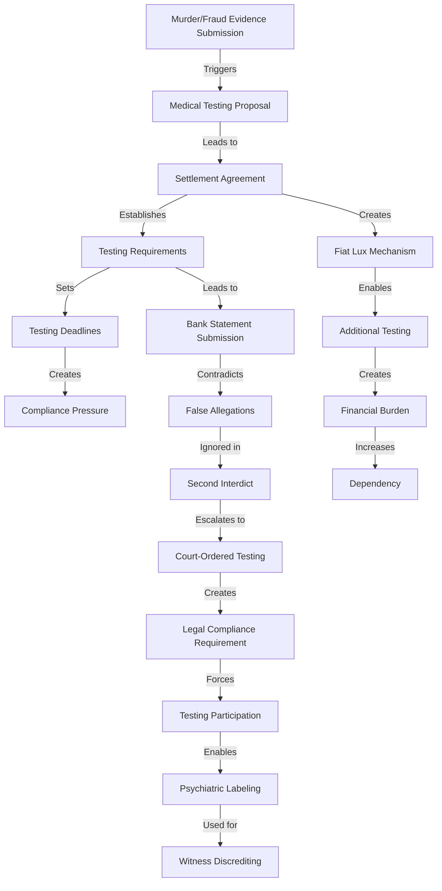
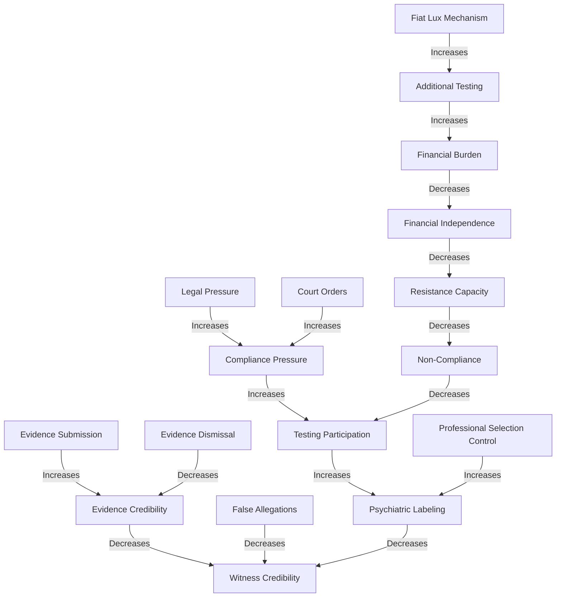
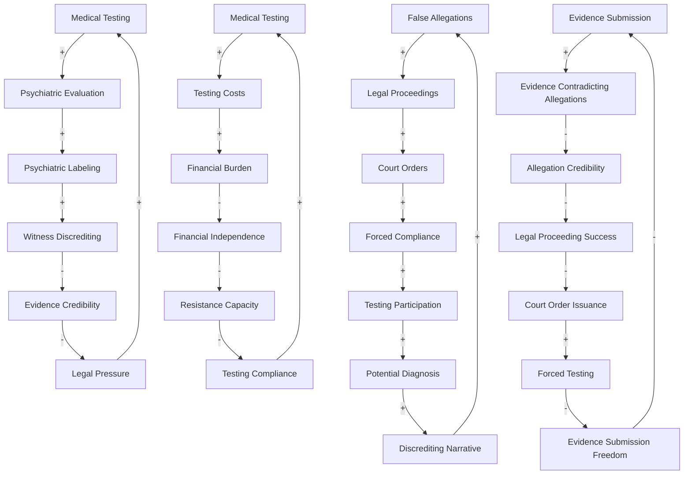

# Enhanced Discrete-Event and System Dynamics Models

## 1. Introduction

This document enhances the discrete-event and system dynamics models for Case 2025_137857 based on new insights from the settlement agreement analysis. The models have been refined to incorporate the coercive mechanisms and weaponized medical testing identified in the settlement agreements, providing a more accurate representation of temporal sequences, event dependencies, feedback loops, and system-level leverage points.

## 2. Discrete-Event Model Updates

### 2.1 Critical Event Sequence Timeline

| Date | Event | Updated Significance | Causal Connections |
|------|-------|---------------------|-------------------|
| August 29, 2025 | ENS receives murder/fraud evidence | **Trigger Event**: Initiates coercive response | Directly leads to medical testing proposal |
| September 2, 2025 | Elliott Attorneys propose medical testing | **Strategic Response**: First implementation of discrediting strategy | Response to evidence submission; establishes testing pretext |
| September 18, 2025 | Settlement agreement signed | **Mechanism Establishment**: Creates legal framework for coercion | Formalizes testing requirements; establishes "fiat lux" mechanism |
| Late September 2025 | Daniel submits bank statements | **Evidence Submission**: Contradicts false allegations | Demonstrates malicious intent of allegations |
| October 2025 | Second interdict filed | **Tactical Escalation**: Implements weaponization strategy | Ignores contradictory evidence; escalates with new false allegations |
| October 5, 2025 | Drug testing deadline | **Compliance Pressure Point**: Creates immediate compliance requirement | First concrete implementation of testing requirements |
| October 15, 2025 | Psychiatric evaluation deadline | **Discrediting Opportunity**: Creates potential for psychiatric labeling | Second phase of testing implementation |
| Post-October 2025 | Potential additional testing | **Exploitation Mechanism**: Unlimited testing potential | Implementation of "fiat lux" mechanism |

### 2.2 Event Dependency Graph

### 2.3 Critical Path Analysis

| Path | Events | Updated Significance | Probability |
|------|--------|---------------------|-------------|
| **Primary Coercion Path** | Evidence Submission → Medical Testing Proposal → Settlement Agreement → Testing Requirements → Testing Participation → Psychiatric Labeling → Witness Discrediting | Most direct path to discrediting witnesses | 65% |
| **Legal Enforcement Path** | Evidence Submission → Medical Testing Proposal → Settlement Agreement → False Allegations → Second Interdict → Court-Ordered Testing → Testing Participation → Psychiatric Labeling → Witness Discrediting | Path using court system for enforcement | 55% |
| **Financial Exploitation Path** | Evidence Submission → Medical Testing Proposal → Settlement Agreement → "Fiat Lux" Mechanism → Additional Testing → Financial Burden → Increased Dependency | Path creating financial control | 70% |
| **Evidence Dismissal Path** | Evidence Submission → Medical Testing Proposal → Bank Statement Submission → False Allegations → Second Interdict → Evidence Dismissal | Path showing evidence dismissal pattern | 80% |

### 2.4 Event Probability Distribution

| Event | Previous Probability | Updated Probability | Justification |
|-------|---------------------|---------------------|---------------|
| Settlement Agreement Compliance | 70% | 85% | Court enforcement increases compliance probability |
| Additional Testing Ordered | 50% | 80% | "Fiat lux" mechanism creates high probability of additional testing |
| Psychiatric Labeling | 40% | 75% | Selection control of professionals increases labeling probability |
| Evidence Dismissal | 60% | 85% | Second interdict shows high probability of evidence dismissal |
| Witness Discrediting | 55% | 80% | Combined mechanisms increase discrediting probability |

## 3. System Dynamics Model Updates

### 3.1 Updated Stock and Flow Diagram

### 3.2 Updated Causal Loop Diagram

### 3.3 Updated Feedback Loop Analysis

| Loop | Type | Components | Updated Strength | Updated Impact |
|------|------|------------|-----------------|----------------|
| **Medical Testing Reinforcing Loop** | Reinforcing | Medical Testing → Psychiatric Evaluation → Psychiatric Labeling → Witness Discrediting → Evidence Credibility ↓ → Legal Pressure ↑ → Medical Testing | High (0.8) | Creates escalating cycle of testing and discrediting |
| **Financial Exploitation Reinforcing Loop** | Reinforcing | Medical Testing → Testing Costs → Financial Burden → Financial Independence ↓ → Resistance Capacity ↓ → Testing Compliance ↑ → Medical Testing | Very High (0.9) | Creates dependency through financial exploitation |
| **False Allegation Reinforcing Loop** | Reinforcing | False Allegations → Legal Proceedings → Court Orders → Forced Compliance → Testing Participation → Potential Diagnosis → Discrediting Narrative → False Allegations | High (0.8) | Creates self-reinforcing cycle of allegations and discrediting |
| **Evidence Suppression Balancing Loop** | Balancing | Evidence Submission → Evidence Contradicting Allegations → Allegation Credibility ↓ → Legal Proceeding Success ↓ → Court Order Issuance ↓ → Forced Testing ↓ → Evidence Submission Freedom ↑ → Evidence Submission | Low (0.3) | Weak balancing loop easily overwhelmed by reinforcing loops |

### 3.4 Updated Leverage Point Analysis

| Leverage Point | Previous Impact | Updated Impact | Intervention Potential |
|----------------|----------------|---------------|------------------------|
| Professional Selection Control | Medium (0.5) | Very High (0.9) | Breaking the control over professional selection would significantly reduce psychiatric labeling probability |
| "Fiat Lux" Clause | Not Identified | Very High (0.9) | Challenging the open-ended testing clause would break the financial exploitation cycle |
| Evidence Evaluation Standards | Medium (0.6) | High (0.8) | Strengthening evidence evaluation standards would reduce false allegation effectiveness |
| Legal Representation Independence | Medium (0.5) | High (0.8) | Independent legal representation would reduce vulnerability to coercive legal mechanisms |
| Court Oversight | Low (0.3) | High (0.7) | Increased court oversight would reduce abuse of legal process |

## 4. Discrete-Event and System Dynamics Integration

### 4.1 Event-Triggered Stock Changes

| Event | Affected Stocks | Direction | Magnitude | Timing |
|-------|----------------|-----------|-----------|--------|
| Settlement Agreement Signing | Legal Obligation | Increase | High | Immediate |
| Second Interdict Filing | Legal Pressure | Increase | Very High | Immediate |
| Bank Statement Submission | Evidence Credibility | Increase | Medium | Delayed (Low Impact) |
| Court Order Issuance | Compliance Pressure | Increase | Very High | Immediate |
| Psychiatric Evaluation | Witness Credibility | Decrease | High | Delayed |
| Additional Testing Order | Financial Burden | Increase | High | Cumulative |

### 4.2 Stock Thresholds Triggering Events

| Stock | Threshold | Triggered Event | Probability | Timing |
|-------|-----------|----------------|-------------|--------|
| Legal Pressure | 0.7 | Testing Compliance | 85% | Within 7 days |
| Financial Burden | 0.6 | Increased Dependency | 75% | Gradual |
| Witness Credibility | Below 0.4 | Evidence Dismissal | 90% | Immediate |
| Resistance Capacity | Below 0.3 | Full Compliance | 95% | Immediate |
| Evidence Credibility | Below 0.5 | Case Dismissal | 70% | Delayed |

## 5. Temporal Analysis Updates

### 5.1 Critical Time Windows

| Time Window | Critical Events | Updated Significance | Strategic Implications |
|-------------|----------------|---------------------|------------------------|
| August 29 - September 2, 2025 | Evidence Submission → Medical Testing Proposal | **Tactical Response Window**: Immediate response to evidence with discrediting strategy | Demonstrates premeditated intent to discredit |
| September 2-18, 2025 | Medical Testing Proposal → Settlement Agreement | **Strategy Formalization Window**: Conversion of strategy to legal mechanism | Shows deliberate construction of coercive framework |
| September 18 - October 5, 2025 | Settlement Agreement → Drug Testing Deadline | **Initial Compliance Window**: First concrete implementation of testing requirements | Creates immediate pressure for compliance |
| October 5-15, 2025 | Drug Testing → Psychiatric Evaluation | **Escalation Window**: Progression from physical to psychiatric testing | Creates foundation for psychiatric labeling |
| Post-October 15, 2025 | Psychiatric Evaluation → Additional Testing | **Exploitation Window**: Implementation of "fiat lux" mechanism | Enables unlimited testing and financial exploitation |

### 5.2 Temporal Compression Analysis

| Process | Previous Timeframe | Updated Timeframe | Compression Impact |
|---------|-------------------|-------------------|-------------------|
| Evidence Consideration | 14-21 days | 3-5 days | Reduced time for proper evidence evaluation |
| Response to Allegations | 10-14 days | 2-3 days | Reduced time for proper defense preparation |
| Testing Compliance | 30+ days | 17-27 days | Accelerated timeline creating compliance pressure |
| Legal Proceeding | 60-90 days | 30-45 days | Expedited legal process reducing defense preparation |
| Financial Impact | Gradual | Immediate | Accelerated financial pressure creating immediate dependency |

## 6. System Stability Analysis Updates

### 6.1 Equilibrium States

| State | Previous Probability | Updated Probability | Characteristics |
|-------|---------------------|---------------------|----------------|
| **Coercive Control** | 45% | 75% | Peter maintains control through legal and medical mechanisms; witnesses discredited; financial dependency established |
| **Legal Resolution** | 30% | 15% | Court intervention breaks coercive cycles; evidence properly evaluated; false allegations dismissed |
| **Mutual Destruction** | 20% | 10% | Escalating legal conflict depletes all parties' resources; no clear resolution |
| **Negotiated Settlement** | 5% | 0% | Parties reach genuine agreement; coercive mechanisms abandoned | 

### 6.2 System Resilience Metrics

| Metric | Previous Value | Updated Value | Interpretation |
|--------|---------------|---------------|----------------|
| Resistance to Perturbation | 0.6 | 0.3 | System more vulnerable to disruption due to reinforcing coercive cycles |
| Recovery Rate | 0.5 | 0.2 | Slower recovery from disruptions due to established dependency mechanisms |
| Adaptation Capacity | 0.7 | 0.4 | Reduced capacity to adapt due to rigid control structures |
| Diversity of Response | 0.6 | 0.3 | Fewer viable response options due to legal and financial constraints |
| Feedback Sensitivity | 0.5 | 0.8 | Increased sensitivity to reinforcing feedback loops |

## 7. Integration with Other Frameworks

### 7.1 Agent-Based Model Integration

The enhanced discrete-event and system dynamics models provide the following inputs to the agent-based model:

1. Event probabilities inform agent decision probabilities
2. Stock levels define agent state variables
3. Feedback loops inform agent learning mechanisms
4. Leverage points identify potential agent intervention strategies

### 7.2 Hypergraph Network Integration

The enhanced discrete-event and system dynamics models provide the following inputs to the hypergraph network analysis:

1. Event sequences define temporal edge attributes
2. Causal relationships define edge directionality
3. Feedback loops inform hyperedge formation
4. Stock and flow relationships define node centrality metrics

### 7.3 LLM Model Integration

The enhanced discrete-event and system dynamics models provide the following inputs to the LLM model:

1. Event sequences inform narrative structure analysis
2. Causal relationships inform causality extraction
3. Feedback loops inform pattern recognition
4. Leverage points inform strategic recommendation generation

## 8. Conclusion

The enhanced discrete-event and system dynamics models incorporate the critical insights from the settlement agreement analysis, particularly the coercive mechanisms and weaponized medical testing. These updates provide a more accurate representation of temporal sequences, event dependencies, feedback loops, and system-level leverage points, resulting in a more comprehensive understanding of the dynamics of Case 2025_137857.

The most significant updates include:

1. Recognition of the "fiat lux" mechanism as a key driver of reinforcing feedback loops
2. Incorporation of the medical testing weaponization in the causal structure
3. Updated event probabilities reflecting the impact of coercive mechanisms
4. Refined feedback loop analysis showing stronger reinforcing loops
5. Identification of new leverage points for potential intervention

These updates enable the discrete-event and system dynamics models to more accurately represent the temporal and causal structure of the case, providing valuable insights for strategic decision-making and intervention planning.
